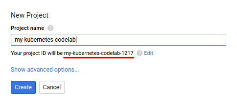
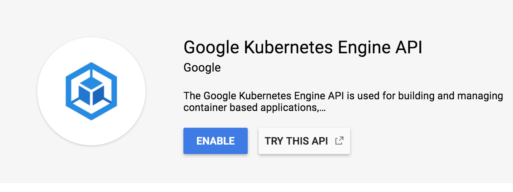
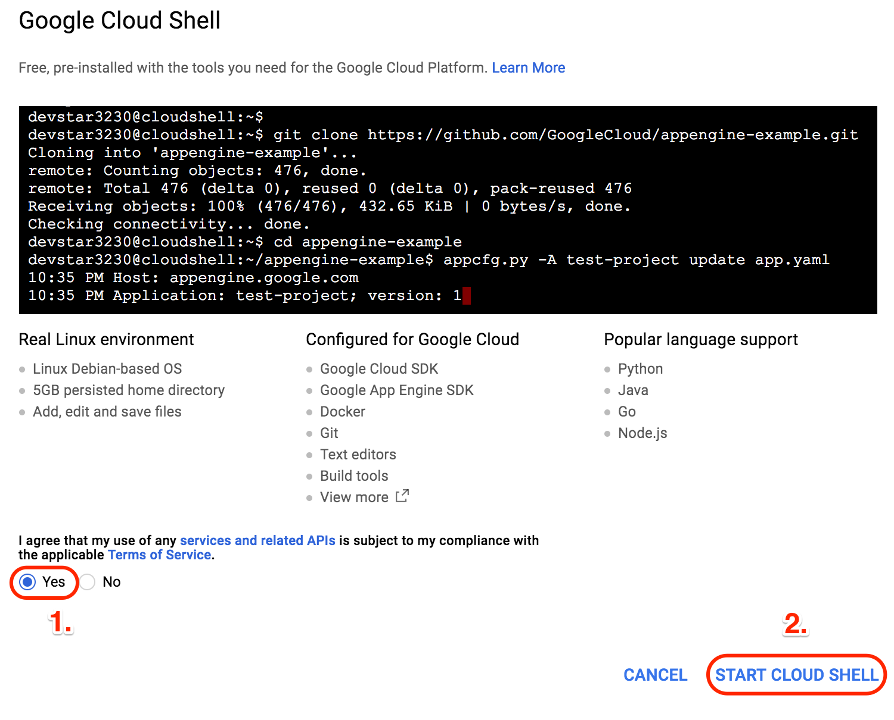
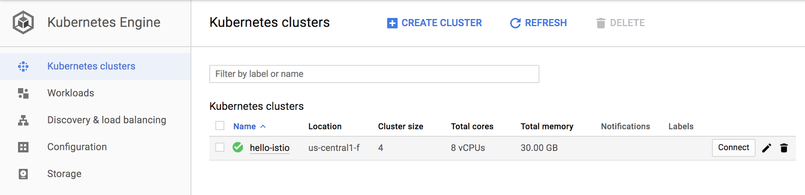
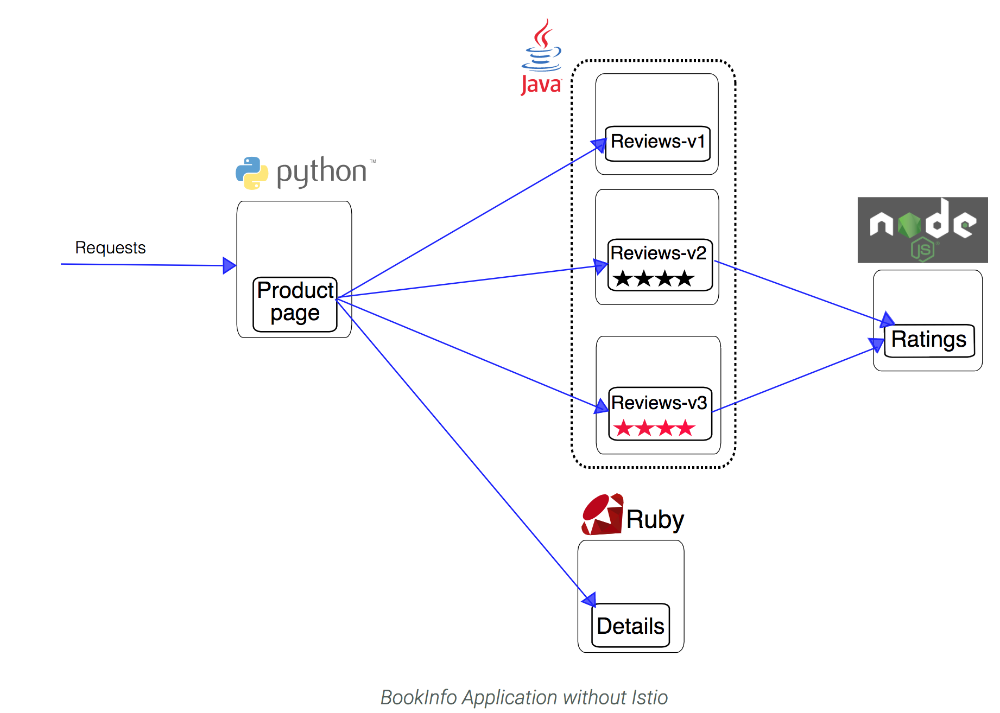
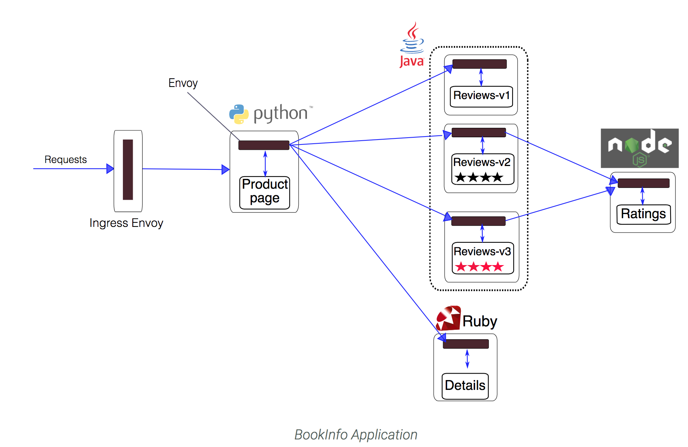
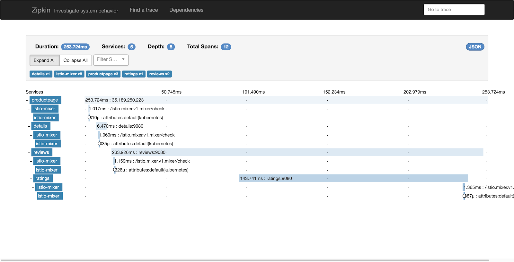
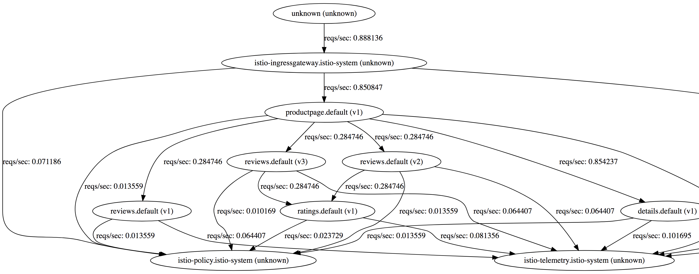

# Hands-on workshop on Istio (with Kubernetes)
Estimated duration: 60 minutes


## Summary 
In this lab, you will learn how to install and configure Istio, an open source framework for connecting, securing, and managing microservices, on Google Kubernetes Engine, Google's hosted Kubernetes product. You will also deploy an Istio-enabled multi-service application.

# Table of Contents
1. [Introduction](#introduction)
2. [Setup and Requirements](#setup-and-requirements)
3. [Prepare your Kubernetes/GKE cluster](#prepare-your-kubernetes-cluster)
4. [Installing Istio](#installing-istio)
5. [Verifying the installation](#verifying-the-installation)
6. [Deploying an application](#deploying-an-application)
7. [Use the application](#use-the-application)
8. [Dynamically change request routing](#dynamically-change-request-routing)
9. [View metrics and tracing](#viewing-metrics-and-tracing)
10. [Monitoring for Istio](#monitoring-for-istio)
11. [Generating a Service Graph](#generate-graph)
12. [Fault Injection](#fault-injection)
13. [Security](#security)
14. [Uninstall Istio](#uninstall-istio)
15. [Cleanup resources](#cleanup-resources)
16. [What's next?](#what-next?)


## Introduction <a name="introduction"/>

[Istio](http://istio.io) is an open source framework for connecting, securing, and managing microservices, including services running on Google Kubernetes Engine (GKE). It lets you create a network of deployed services with load balancing, service-to-service authentication, monitoring, and more, without requiring any changes in service code.

You add Istio support to services by deploying a special Envoy sidecar proxy to each of your application&#39;s pods in your environment that intercepts all network communication between microservices, configured and managed using Istio'&#39;'s control plane functionality.

This codelab shows you how to install and configure Istio on Kubernetes Engine, deploy an Istio-enabled multi-service application, and dynamically change request routing.

## Setup and Requirements <a name="setup-and-requirements"/>

If you don&#39;t already have a Google Account (Gmail or Google Apps), you must [create one](https://accounts.google.com/SignUp). Sign-in to Google Cloud Platform console ( [console.cloud.google.com](http://console.cloud.google.com)) and create a new project:
 
 
 

Remember the project ID, a unique name across all Google Cloud projects (the name above has already been taken and will not work for you, sorry!). It will be referred to later in this codelab as PROJECT\_ID.

Next, you&#39;ll need to [enable billing](https://console.cloud.google.com/billing) in the Developers Console in order to use Google Cloud resources.

Running through this codelab shouldn&#39;t cost you more than a few dollars, but it could be more if you decide to use more resources or if you leave them running (see &quot;cleanup&quot; section at the end of this document). Google Kubernetes Engine pricing is documented [here](https://cloud.google.com/kubernetes-engine/docs/#pricing).

New users of Google Cloud Platform are eligible for a [$300 free trial](https://console.developers.google.com/billing/freetrial?hl=en).

### Enable API
Enable the Kubernetes Engine API:
1. First click on APIs and Services on the right pane


2. Check if the Kubernetes APIs are enabled


3. If you **CANNOT** find this in your project, then Kubernetes APIs are not enabled. Proceed further. Otherwise skip the following steps.

4. Click on **ENABLE APIS AND SERVICES**


5. Start typing _**ku**_ in the search bar
 

6. Select _Google Kubernetes Engine API_

7. Enable the API. This step could take 2 or 3 minutes.



### Google Cloud Shell
While Google Cloud and Kubernetes can be operated remotely from your laptop, in this workshop we will be using Google Cloud Shell, a command line environment running in the Cloud.

This Debian-based virtual machine is loaded with all the development tools you'll need. It offers a persistent 5GB home directory, and runs on the Google Cloud, greatly enhancing network performance and authentication. This means that all you will need for this codelab is a browser (yes, it works on a Chromebook).

To activate Google Cloud Shell, from the developer console simply click the button on the top right-hand side (it should only take a few moments to provision and connect to the environment):


Then accept the terms of service and click the "Start Cloud Shell" link:



Once connected to the cloud shell, you should see that you are already authenticated and that the project is already set to your _PROJECT_ID_

## Prepare your Kubernetes/GKE cluster <a name="prepare-your-kubernetes-cluster"/>

The requirements for this Istio lab are as follows:

- your cluster should use Kubernetes 1.8.0 or newer, which includes [role-based access control (RBAC)](https://cloud-dot-devsite.googleplex.com/container-engine/docs/role-based-access-control) support.
- you need to [create your cluster with alpha feature support](https://cloud.google.com/container-engine/docs/alpha-clusters), as Istio makes use of [initializers](https://kubernetes.io/docs/admin/extensible-admission-controllers/#enable-initializers-alpha-feature) to [automatically install the Istio Proxy into every Pod](https://istio.io/docs/setup/kubernetes/sidecar-injection.html#automatic-sidecar-injection)

To create a new cluster that meets these requirements, including alpha features, run the following commands (this assumes that you have correctly set a zone as indicated in the setup) :

```
    gcloud container clusters create hello-istio \
    --machine-type=n1-standard-2 \
    --num-nodes=5 \
    --no-enable-legacy-authorization \
    --zone=us-west1-b \
    --cluster-version=1.8.7-gke.0
```

Setup Kubernetes CLI Content:

```gcloud container clusters get-credentials hello-istio --zone us-west1-b --project PROJECT_ID```

Now, grant cluster admin permissions to the current user. You need these permissions to create the necessary RBAC rules for Istio.

```
    kubectl create clusterrolebinding cluster-admin-binding \
    --clusterrole=cluster-admin \
    --user=$(gcloud config get-value core/account)
```

If you navigate in the GCP console to Kubernetes clusters you should see a screen similar to this:



## Installing Istio <a name="installing-istio"/>

Now, let&#39;s install Istio. Istio is installed in its own Kubernetes istio-system namespace, and can manage microservices from all other namespaces. The installation includes Istio core components, tools, and samples.

The [Istio release page](https://github.com/istio/istio/releases) offers download artifacts for several OSs. In our case, with CloudShell we&#39;ll be using this command to download and extract the latest release automatically:

```curl -L https://git.io/getLatestIstio | sh -```

The installation directory contains the following:

- Installation .yaml files for Kubernetes in **install/**
- Sample applications in **samples/**
- The istioctl client binary in the **bin/** directory. This tool is used when manually injecting Envoy as a sidecar proxy and for creating routing rules and policies.
- The VERSION configuration file

Change to the istio install directory:

```cd ./istio-* ```

Add the istioctl client to your PATH:

```export PATH=$PWD/bin:$PATH```

Let&#39;s now install Istio&#39;s core components. We will install the Istio Auth components which enable [**mutual TLS authentication**](https://istio.io/docs/concepts/security/mutual-tls.html) between sidecars:

```kubectl apply -f install/kubernetes/istio-auth.yaml```

This creates the istio-system namespace along with the required RBAC permissions, and deploys Istio-Pilot, Istio-Mixer, Istio-Ingress, Istio-Egress, and Istio-CA (Certificate Authority).

## Verifying the installation <a name="verifying-the-installation"/>

First, ensure the following Kubernetes services are deployed: istio-pilot, istio-mixer, istio-ingress, and istio-egress.

Run the command:
```
kubectl get svc -n istio-system
```
OUTPUT:

```
NAME            CLUSTER-IP      EXTERNAL-IP       PORT(S)                       AGE
istio-ingress   10.83.245.171   35.184.245.62     80:32730/TCP,443:30574/TCP    3m
istio-pilot     10.83.251.173   <none>            8080/TCP,8081/TCP             3m
istio-mixer     10.83.244.253   <none>            9091/TCP,9094/TCP,42422/TCP   3m
```

Then make sure that the corresponding Kubernetes pods are deployed and all containers are up and running: istio-pilot-\*, istio-mixer-\*, istio-ingress-\*, istio-ca-\*.

Run the command:
```
kubectl get pods -n istio-system
```
OUTPUT:
```
NAME                                READY     STATUS    RESTARTS   AGE
istio-ca-3657790228-j21b9           1/1       Running   0          3m
istio-ingress-1842462111-j3vcs      1/1       Running   0          3m
istio-pilot-2275554717-93c43        1/1       Running   0          3m
istio-mixer-2104784889-20rm8        2/2       Running   0          3m
```

When all the pods are running, you can proceed.

## Deploying an application <a name="deploying-an-application"/>

Now Istio is installed and verified, you can deploy one of the sample applications provided with the installation — [BookInfo](https://istio.io/docs/guides/bookinfo.html). This is a simple mock bookstore application made up of four services that provide a web product page, book details, reviews (with several versions of the review service), and ratings - all managed using Istio.

You will find the source code and all the other files used in this example in your Istio [samples/bookinfo](https://github.com/istio/istio/tree/master/samples/bookinfo) directory. These steps will deploy the BookInfo application&#39;s services in an Istio-enabled environment, with Envoy sidecar proxies injected alongside each service to provide Istio functionality.

### Overview
In this guide we will deploy a simple application that displays information about a book, similar to a single catalog entry of an online book store. Displayed on the page is a description of the book, book details (ISBN, number of pages, and so on), and a few book reviews.

The BookInfo application is broken into four separate microservices:

* productpage. The productpage microservice calls the details and reviews microservices to populate the page.
* details. The details microservice contains book information.
* reviews. The reviews microservice contains book reviews. It also calls the ratings microservice.
* ratings. The ratings microservice contains book ranking information that accompanies a book review.

There are 3 versions of the reviews microservice:

* Version v1 doesn’t call the ratings service.
* Version v2 calls the ratings service, and displays each rating as 1 to 5 black stars.
* Version v3 calls the ratings service, and displays each rating as 1 to 5 red stars.

The end-to-end architecture of the application is shown below.



### Deploy Bookinfo

We deploy our application directly using kubectl create and its regular YAML deployment file. We will inject Envoy containers into your application pods using istioctl:

```kubectl create -f <(istioctl kube-inject -f samples/bookinfo/kube/bookinfo.yaml)```

Finally, confirm that the application has been deployed correctly by running the following commands:

Run the command:
```
kubectl get services
```
OUTPUT:
```
NAME                       CLUSTER-IP   EXTERNAL-IP   PORT(S)              AGE
details                    10.0.0.31    <none>        9080/TCP             6m
kubernetes                 10.0.0.1     <none>        443/TCP              21m
productpage                10.0.0.120   <none>        9080/TCP             6m
ratings                    10.0.0.15    <none>        9080/TCP             6m
reviews                    10.0.0.170   <none>        9080/TCP             6m
```

Run the command:
```
kubectl get pods
```

OUTPUT:
```
NAME                                        READY     STATUS    RESTARTS   AGE
details-v1-1520924117-48z17                 2/2       Running   0          6m
productpage-v1-560495357-jk1lz              2/2       Running   0          6m
ratings-v1-734492171-rnr5l                  2/2       Running   0          6m
reviews-v1-874083890-f0qf0                  2/2       Running   0          6m
reviews-v2-1343845940-b34q5                 2/2       Running   0          6m
reviews-v3-1813607990-8ch52                 2/2       Running   0          6m
```

With Envoy sidecars injected along side each service, the architecture will look like this:



## Use the application <a name="use-the-application"/>

Now that it&#39;s deployed, let&#39;s see the BookInfo application in action.

First you need to get the ingress IP and port, as follows:

```
kubectl get ingress -o wide 
```
OUTPUT:
```
NAME      HOSTS     ADDRESS                 PORTS     AGE
gateway   *         130.211.10.121          80        3m
```

Based on this information (Address), set the GATEWAY\_URL environment variable:

```export GATEWAY_URL=130.211.10.121:80```

NOTE : don't forget to append `:80` in the GATEWAY_URL

Once you have the address and port, check that the BookInfo app is running with curl:

Run the command:
```
curl -o /dev/null -s -w "%{http_code}\n" http://${GATEWAY_URL}/productpage
```
OUTPUT:
```
200
```

Then point your browser to _**http://$GATEWAY\_URL/productpage**_ to view the BookInfo web page. If you refresh the page several times, you should see different versions of reviews shown in the product page, presented in a round robin style (red stars, black stars, no stars), since we haven&#39;t yet used Istio to control the version routing


## Dynamically change request routing <a name="dynamically-change-request-routing"/>

The BookInfo sample deploys three versions of the reviews microservice. When you accessed the application several times, you will have noticed that the output sometimes contains star ratings and sometimes it does not. This is because without an explicit default version set, Istio will route requests to all available versions of a service in a random fashion.

We use the istioctl command line tool to control routing, adding a route rule that says all traffic should go to the v1 service. First, confirm there are no route rules installed :

```istioctl get routerules -o yaml```

No Resouces will be found. Now, create the rule (check out the source yaml file it you&#39;d like to understand how rules are specified) :

Run the command:
```
istioctl create -f samples/bookinfo/kube/route-rule-all-v1.yaml -n default
```
OUTPUT:
```
Created config route-rule/default/productpage-default at revision 136126
Created config route-rule/default/reviews-default at revision 136127
Created config route-rule/default/ratings-default at revision 136128
Created config route-rule/default/details-default at revision 136130
```

Look at the rule you&#39;ve just created:

```
istioctl get routerules -o yaml
```

Go back to the Bookinfo application (http://$GATEWAY\_URL/productpage) in your browser. You should see the BookInfo application productpage displayed. Notice that the productpage is displayed with no rating stars since reviews:v1 does not access the ratings service.

To test reviews:v2, but only for a certain user, let&#39;s create this rule:

```
istioctl create -f samples/bookinfo/kube/route-rule-reviews-test-v2.yaml -n default
```

Check out the route-rule-reviews-test-v2.yaml file to see how this rule is specified :

```
$ cat samples/bookinfo/kube/route-rule-reviews-test-v2.yaml
```
OUTPUT:
```
apiVersion: config.istio.io/v1alpha2
kind: RouteRule
metadata:
  name: reviews-test-v2
spec:
  destination:
    name: reviews
  precedence: 2
  match:
    request:
      headers:
        cookie:
          regex: "^(.*?;)?(user=jason)(;.*)?$"
  route:
  - labels:
      version: v2
```

Look at the rule you&#39;ve just created :

```istioctl get routerule reviews-test-v2 -o yaml```

We now have a way to route some requests to use the reviews:v2 service. Can you guess how? (Hint: no passwords are needed) See how the page behaviour changes if you are logged in as no-one and &#39;jason&#39;.

You can read the [documentation page](https://istio.io/docs/tasks/traffic-management/request-routing.html) for further details on Istio&#39;s request routing.

Once the v2 version has been tested to our satisfaction, we could use Istio to send traffic from all users to v2, optionally in a gradual fashion.

For now, let&#39;s clean up the routing rules:

```
istioctl delete -f samples/bookinfo/kube/route-rule-all-v1.yaml -n default 
istioctl delete -f samples/bookinfo/kube/route-rule-reviews-test-v2.yaml -n default
```

## View metrics and tracing <a name="viewing-metrics-and-tracing"/>

Istio-enabled applications can be configured to collect trace spans using, for instance, the popular Zipkin distributed tracing system. Distributed tracing lets you see the flow of requests a user makes through your system, and Istio&#39;s model allows this regardless of what language/framework/platform you use to build your application.

First, install the Zipkin addon :

```kubectl apply -f install/kubernetes/addons/zipkin.yaml```

Istio is now configured to send request information.

Configure port forwarding (works on Google Cloud Shell only):

```kubectl port-forward -n istio-system $(kubectl get pod -n istio-system -l app=zipkin -o jsonpath='{.items[0].metadata.name}') 8080:9411 &```

Open your browser at [http://localhost:9411](http://localhost:9411)

Load the Bookinfo application again (http://$GATEWAY_URL/productpage).

Select a trace from the list, and you will now see something similar to the following:



You can see how long each microservice call took, including the Istio checks.

You can read the [documentation page](https://istio.io/docs/tasks/telemetry/distributed-tracing.html) for further details on Istio&#39;s distributed request tracing.

## Monitoring for Istio <a name="monitoring-for-istio"/>

This task shows you how to setup and use the Istio Dashboard to monitor mesh traffic. As part of this task, you will install the Grafana Istio addon and use the web-based interface for viewing service mesh traffic data.

First, install the Prometheus addon :

```kubectl apply -f install/kubernetes/addons/prometheus.yaml```

Istio is now configured to send monitoring information to Prometheus.

Next, we install the Grafana addon:

```kubectl apply -f install/kubernetes/addons/grafana.yaml```

Grafana will be used to visualize the data prometheus.

Configure port forwarding (works on Google shell only):

```kubectl -n istio-system port-forward $(kubectl -n istio-system get pod -l app=grafana -o jsonpath='{.items[0].metadata.name}') 8080:3000 &```

Open your browser at [http://localhost:3000](http://localhost:3000)

Load the Bookinfo application again (http://$GATEWAY_URL/productpage).

Select a trace from the list, and you will now see something similar to the following:

 

## Generating a Service Graph <a name="generate-graph"/>
**NOTE**: With version 0.5, there is a problem with the service graph build. If you're using 0.5 you cannot complete this lab. Find out which version of istio you're running by:
```
istioctl version
```
 
This task shows you how to generate a graph of services within an Istio mesh. As part of this task, you will install the ServiceGraph addon and use the web-based interface for viewing service graph of the service mesh.

First, install the Service Graph addon :

```kubectl apply -f install/kubernetes/addons/servicegraph.yaml```

Configure port forwarding (works on Google Cloud Shell only):

```kubectl -n istio-system port-forward $(kubectl -n istio-system get pod -l app=servicegraph -o jsonpath='{.items[0].metadata.name}') 8080:8088 &```

Ppen your browser at [http://localhost:8088/dotviz](http://localhost:8088/dotviz)

You will now see something similar to the following:



## Fault Injection <a name="fault-injection"/>

This task shows how to inject delays and test the resiliency of your application.

*_Note: This assumes you don’t have any routes set yet. If you’ve already created conflicting route rules for the sample, you’ll need to use replace rather than create in one or both of the following commands._*

To test our BookInfo application microservices for resiliency, we will inject a 7s delay between the reviews:v2 and ratings microservices, for user “jason”. Since the reviews:v2 service has a 10s timeout for its calls to the ratings service, we expect the end-to-end flow to continue without any errors.

Create a fault injection rule to delay traffic coming from user “jason” (our test user)

```
istioctl create -f samples/bookinfo/kube/route-rule-ratings-test-delay.yaml
```

Run the command:
```
istioctl get routerule ratings-test-delay -o yaml
```
You should see the yaml for the routing rule. Allow several seconds to account for rule propagation delay to all pods.

### Observe application behavior

Log in as user “jason”. If the application’s front page was set to correctly handle delays, we expect it to load within approximately 7 seconds. To see the web page response times, open the Developer Tools menu in IE, Chrome or Firefox (typically, key combination _Ctrl+Shift+I or Alt+Cmd+I_), tab Network, and reload the _productpage_ web page.

You will see that the webpage loads in about 6 seconds. The reviews section will show _Sorry, product reviews are currently unavailable for this book_.

### Understanding what happened
The reason that the entire reviews service has failed is because our BookInfo application has a bug. The timeout between the productpage and reviews service is less (3s + 1 retry = 6s total) than the timeout between the reviews and ratings service (10s). These kinds of bugs can occur in typical enterprise applications where different teams develop different microservices independently. Istio’s fault injection rules help you identify such anomalies without impacting end users.

**Notice that we are restricting the failure impact to user “jason” only. If you login as any other user, you would not experience any delays**

## Security <a name="security"/>
### Testing Istio mutual TLS authentication
Through this task, you will learn how to:
* Verify the Istio mutual TLS Authentication setup
* Manually test the authentication
#### Verifying Istio CA
Verify the cluster-level CA is running:

```
kubectl get deploy -l istio=istio-ca -n istio-system
```
OUTPUT:
```
NAME       DESIRED   CURRENT   UP-TO-DATE   AVAILABLE   AGE
istio-ca   1         1         1            1           1m
```
#### Verify Service Configuration
#### Verify AuthPolicy setting in ConfigMap
```
kubectl get configmap istio -o yaml -n istio-system | grep authPolicy | head -1
```
Istio mutual TLS authentication is enabled if the line **authPolicy: MUTUAL_TLS** is uncommented (doesn’t have a **#**).
#### Testing the authentication setup
We are going to install a sample application into the cluster and try and access the services directly.

1. Switch to the sample app folder
```
git clone https://github.com/srinandan/istio-workshop.git && istio-workshop/mtlstest
```

2. Set the PROJECT_ID as the environment variable
```
export PROJECT_ID=test
```

3. Edit the Kubernetes configuration file (mtlstest.yaml) and add the PROJECT_ID
```
vi mtlstest.yaml
```

change this and add the project id:
```
image: gcr.io/PROJECT_ID/mtlstest:latest
```
save the file.

4. Build the docker image and push it to GCR (Google Container Repo)
```
./dockerbuild.sh
```
NOTE: you may have to run "chmod +x dockerbuild.sh"

5. Deploy the app to Kubernetes
```
./k8ssetup.sh
```

6. Verify the application was deployed successfully
```
kubectl get pods
```

OUTPUT:
```
NAME          TYPE        CLUSTER-IP      EXTERNAL-IP   PORT(S)    AGE
details       ClusterIP   10.59.254.1     <none>        9080/TCP   12m
kubernetes    ClusterIP   10.59.240.1     <none>        443/TCP    18m
mtlstest      ClusterIP   10.59.253.170   <none>        8080/TCP   7m
productpage   ClusterIP   10.59.251.133   <none>        9080/TCP   12m
ratings       ClusterIP   10.59.251.105   <none>        9080/TCP   12m
reviews       ClusterIP   10.59.250.46    <none>        9080/TCP   12m
```
NOTE: The cluster IP for the **details** app. This app is running on port 9080

7. Access the mtltest pod
```
kubectl exec -it mtlstest-bbf7bd6c-9rmwn /bin/bash
```

8. Run cURL to access to the details app
```
curl -k -v https://10.59.254.1:9080/details/0
```

OUTPUT:
```
* About to connect() to 10.59.254.1 port 9080 (#0)
*   Trying 10.59.254.1...
* Connected to 10.59.254.1 (10.59.254.1) port 9080 (#0)
* Initializing NSS with certpath: sql:/etc/pki/nssdb
* NSS error -12263 (SSL_ERROR_RX_RECORD_TOO_LONG)
* SSL received a record that exceeded the maximum permissible length.
* Closing connection 0
curl: (35) SSL received a record that exceeded the maximum permissible length.
```
**NOTE**: If security (mTLS) was **NOT** enabled on the services, you would have see the output like this:
```
curl http://10.19.249.209:9080/details/0 -v
* About to connect() to 10.19.249.209 port 9080 (#0)
*   Trying 10.19.249.209...
* Connected to 10.19.249.209 (10.19.249.209) port 9080 (#0)
> GET /details/0 HTTP/1.1
> User-Agent: curl/7.29.0
> Host: 10.19.249.209:9080
> Accept: */*
>
< HTTP/1.1 200 OK
< content-type: application/json
< server: envoy
< date: Sun, 04 Feb 2018 23:45:38 GMT
< content-length: 178
< x-envoy-upstream-service-time: 9
<
* Connection #0 to host 10.19.249.209 left intact
{"id":0,"author":"William Shakespeare","year":1595,"type":"paperback","pages":200,"publisher":"PublisherA","language":"English","ISBN-10":"1234567890","ISBN-13":"123-1234567890"}
```

## Uninstall Istio <a name="uninstall-istio"/>

Here&#39;s how to uninstall Istio.

```
kubectl delete -f samples/bookinfo/kube/bookinfo.yaml 
```
OUTPUT:
```
service    'details'    deleted
deployment 'details-v1' deleted
service    'ratings'    deleted
deployment 'ratings-v1' deleted
service    'reviews'    deleted
deployment 'reviews-v1' deleted
deployment 'reviews-v2' deleted
deployment 'reviews-v3' deleted
service    'productpage' deleted
deployment 'productpage-v1' deleted
```
 
```kubectl delete -f install/kubernetes/istio-auth.yaml```

For the current release, uninstalling Istio core components also deletes the RBAC permissions, the istio-system namespace, and hierarchically all resources under it. It is safe to ignore errors for non-existent resources because they may have been deleted hierarchically.

## Cleanup resources <a name="cleanup-resources"/>

In addition to uninstalling Istio, you should also delete the Kubernetes cluster created in the setup phase (to save on cost and to be a good cloud citizen):

```gcloud container clusters delete hello-istio``` 

OUTPUT
```
The following clusters will be deleted. - [hello-istio] in [west1-b]
Do you want to continue (Y/n)?  Y
Deleting cluster hello-istio...done.                                                                                                                                                                                         Deleted [https://container.googleapis.com/v1/projects/codelab-test/zones/us-central1-f/clusters/hello-istio].
```

Of course, you can also delete the entire project but you would lose any billing setup you have done (disabling project billing first is required). Additionally, deleting a project will only stop all billing after the current billing cycle ends.

## What's next <a name="what-next"/>

The [Istio site](https://istio.io/) contains guides and samples with fully working example uses for Istio that you can experiment with. These include:

- [Intelligent Routing](https://istio.io/docs/guides/intelligent-routing.html): this example shows how to use Istio&#39;s various traffic management capabilities with BookInfo, and is a particularly good next step from this tutorial.
- [In-Depth Telemetry](https://istio.io/docs/guides/telemetry.html): this example demonstrates how to get uniform metrics, logs, and traces across BookInfo&#39;s services using Istio Mixer and the Istio sidecar proxy.
