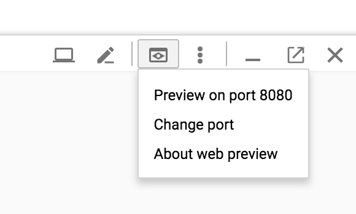

# Istio Service Management and API Management Workshop


## Summary 
In this lab, you will learn how to install and configure Istio, an open source framework for connecting, securing, and managing microservices, on Google Kubernetes Engine, Google's hosted Kubernetes product. You will also deploy an Istio-enabled multi-service application. Once you complete this lab, you can try managing APIs with Istio and Apigee Edge.

# Table of Contents
1. [Introduction](#introduction)
2. [Setup and Requirements](#setup-and-requirements)
3. [Prepare your Kubernetes/GKE cluster](#prepare-your-kubernetes-cluster)
4. [Installing Istio](#installing-istio)
5. [Verifying the installation](#verifying-the-installation)
6. [Deploying an application](#deploying-an-application)
7. [Use the application](#use-the-application)
8. [Dynamically change request routing](#dynamically-change-request-routing)
9. Monitoring and Observability
   - [View metrics and tracing](#viewing-metrics-and-tracing)
   - [Monitoring for Istio](#monitoring-for-istio)
   - [Generating a Service Graph](#generate-graph)
10. [Fault Injection](#fault-injection)
11. [Circuit Breaker](#circuit)
12. [Security](#security)
    - [Testing Istio mutual TLS authentication](#mutual)
    - [Testing Istio RBAC](#rbac)
    - [Testing Istio JWT Policy](#jwt)
13. [Mesh Expansion](./mesh)
14. [Miscellaneous](./misc)
    - Websockets
    - Rate Limiting
    - Expose external services (egress traffic)
15. [API Management](./apimanagement)
    - Installing API Management
    - Publish the API as a product
    - Consume an API Product
    - Obtain an OAuth token
    - View API Analytics
    - Expose APIs to third parties
    - Restrict access to IPs    
16. [Uninstall Istio](#uninstall-istio)

## Introduction <a name="introduction"/>

[Istio](http://istio.io) is an open source framework for connecting, securing, and managing microservices, including services running on Google Kubernetes Engine (GKE). It lets you create a network of deployed services with load balancing, service-to-service authentication, monitoring, and more, without requiring any changes in service code.

You add Istio support to services by deploying a special Envoy sidecar proxy to each of your application&#39;s pods in your environment that intercepts all network communication between microservices, configured and managed using Istio'&#39;'s control plane functionality.

## Setup and Requirements <a name="setup-and-requirements"/>

If you don&#39;t already have a Google Account (Gmail or Google Apps), you must [create one](https://accounts.google.com/SignUp). Sign-in to Google Cloud Platform console ( [console.cloud.google.com](http://console.cloud.google.com)) and create a new project:
 
 
 

Remember the project ID, a unique name across all Google Cloud projects (the name above has already been taken and will not work for you, sorry!). It will be referred to later in this codelab as PROJECT\_ID.

Next, you&#39;ll need to [enable billing](https://console.cloud.google.com/billing) in the Developers Console in order to use Google Cloud resources.

Running through this codelab shouldn&#39;t cost you more than a few dollars, but it could be more if you decide to use more resources or if you leave them running (see &quot;cleanup&quot; section at the end of this document). Google Kubernetes Engine pricing is documented [here](https://cloud.google.com/kubernetes-engine/docs/#pricing).

New users of Google Cloud Platform are eligible for a [$300 free trial](https://console.developers.google.com/billing/freetrial?hl=en).

### Enable API
Enable the Kubernetes Engine API:
1. First click on APIs and Services on the right pane


2. Check if the Kubernetes APIs are enabled


3. If you **CANNOT** find this in your project, then Kubernetes APIs are not enabled. Proceed further. Otherwise skip the following steps.

4. Click on **ENABLE APIS AND SERVICES**


5. Start typing _**ku**_ in the search bar
 

6. Select _Google Kubernetes Engine API_

7. Enable the API. This step could take 2 or 3 minutes.


### Google Cloud Shell
While Google Cloud and Kubernetes can be operated remotely from your laptop, in this workshop we will be using Google Cloud Shell, a command line environment running in the Cloud.

This Debian-based virtual machine is loaded with all the development tools you'll need. It offers a persistent 5GB home directory, and runs on the Google Cloud, greatly enhancing network performance and authentication. This means that all you will need for this codelab is a browser (yes, it works on a Chromebook).

To activate Google Cloud Shell, from the developer console simply click the button on the top right-hand side (it should only take a few moments to provision and connect to the environment):


Then accept the terms of service and click the "Start Cloud Shell" link:


Once connected to the cloud shell, you should see that you are already authenticated and that the project is already set to your _PROJECT_ID_

## Prepare your Kubernetes/GKE cluster <a name="prepare-your-kubernetes-cluster"/>

The requirements for this Istio lab are as follows:

- your cluster should use Kubernetes 1.9.0 or newer, which includes [role-based access control (RBAC)](https://cloud-dot-devsite.googleplex.com/container-engine/docs/role-based-access-control) support.
- you need to [create your cluster with alpha feature support](https://cloud.google.com/container-engine/docs/alpha-clusters), as Istio makes use of [initializers](https://kubernetes.io/docs/admin/extensible-admission-controllers/#enable-initializers-alpha-feature) to [automatically install the Istio Proxy into every Pod](https://istio.io/docs/setup/kubernetes/sidecar-injection.html#automatic-sidecar-injection)

To create a new cluster that meets these requirements, including alpha features, run the following commands (this assumes that you have correctly set a zone as indicated in the setup) :

```
    gcloud container clusters create hello-istio \
    --machine-type=n1-standard-2 \
    --num-nodes=6 \
    --no-enable-legacy-authorization \
    --zone=us-west1-b \
    --cluster-version=1.9.7-gke.3
```

Setup Kubernetes CLI Content:

```gcloud container clusters get-credentials hello-istio --zone us-west1-b --project PROJECT_ID```

Now, grant cluster admin permissions to the current user. You need these permissions to create the necessary RBAC rules for Istio.

```
    kubectl create clusterrolebinding cluster-admin-binding \
    --clusterrole=cluster-admin \
    --user=$(gcloud config get-value core/account)
```

If you navigate in the GCP console to Kubernetes clusters you should see a screen similar to this:


## Installing Istio <a name="installing-istio"/>

Now, let&#39;s install Istio. Istio is installed in its own Kubernetes istio-system namespace, and can manage microservices from all other namespaces. The installation includes Istio core components, tools, and samples.

The [Istio release page](https://github.com/istio/istio/releases) offers download artifacts for several OSs. In our case, with CloudShell we&#39;ll be using this command to download and extract the latest release automatically:

```curl -L https://git.io/getLatestIstio | sh -```

The installation directory contains the following:

- Installation .yaml files for Kubernetes in **install/**
- Sample applications in **samples/**
- The istioctl client binary in the **bin/** directory. This tool is used when manually injecting Envoy as a sidecar proxy and for creating routing rules and policies.
- The VERSION configuration file

Change to the istio install directory:

```cd ./istio-* ```

Add the istioctl client to your PATH:

```export PATH=$PWD/bin:$PATH```

Let&#39;s now install Istio&#39;s core components. We will install the Istio Auth components which enable [**mutual TLS authentication**](https://istio.io/docs/concepts/security/mutual-tls.html) between sidecars:

```kubectl apply -f install/kubernetes/istio-demo-auth.yaml```

This creates the istio-system namespace along with the required RBAC permissions, and deploys Istio-Pilot, Istio-Mixer, Istio-Ingress, Istio-Egress, and Istio-CA (Certificate Authority).

## Verifying the installation <a name="verifying-the-installation"/>

First, ensure the following Kubernetes services are deployed: istio-pilot, istio-mixer, istio-ingress, and istio-egress.

Run the command:
```
kubectl get svc -n istio-system
```
OUTPUT:

```
NAME            CLUSTER-IP      EXTERNAL-IP       PORT(S)                       AGE
grafana                    ClusterIP      10.35.241.104   <none>           3000/TCP                                                              18m
istio-citadel              ClusterIP      10.35.252.114   <none>           8060/TCP,9093/TCP                                                     18m
istio-egressgateway        ClusterIP      10.35.255.114   <none>           80/TCP,443/TCP                                                        18m
istio-galley               ClusterIP      10.35.240.201   <none>           443/TCP                                                               18m
istio-ingressgateway       LoadBalancer   10.35.247.245   xx.xxx.xxx.xxx   80:31380/TCP,443:31390/TCP,31400:31400/TCP                            18m
istio-pilot                ClusterIP      10.35.243.14    <none>           15003/TCP,15005/TCP,15007/TCP,15010/TCP,15011/TCP,8080/TCP,9093/TCP   18m
istio-policy               ClusterIP      10.35.251.186   <none>           9091/TCP,15004/TCP,9093/TCP                                           18m
istio-sidecar-injector     ClusterIP      10.35.253.208   <none>           443/TCP                                                               18m
istio-statsd-prom-bridge   ClusterIP      10.35.254.35    <none>           9102/TCP,9125/UDP                                                     18m
istio-telemetry            ClusterIP      10.35.254.188   <none>           9091/TCP,15004/TCP,9093/TCP,42422/TCP                                 18m
prometheus                 ClusterIP      10.35.253.203   <none>           9090/TCP                                                              18m
servicegraph               ClusterIP      10.35.250.205   <none>           8088/TCP                                                              18m
tracing                    ClusterIP      10.35.242.39    <none>           80/TCP                                                                18m
zipkin                     ClusterIP      10.35.247.252   <none>           9411/TCP                                                              18m
```

Then make sure that the corresponding Kubernetes pods are deployed and all containers are up and running.

Run the command:
```
kubectl get pods -n istio-system
```
OUTPUT:
```
NAME                                READY     STATUS    RESTARTS   AGE
grafana-69fc7b47bd-v4qm8                   1/1       Running   0          17m
istio-citadel-857cf5dc8c-hkdrm             1/1       Running   0          17m
istio-egressgateway-dbf9c5d7c-87d8s        1/1       Running   0          17m
istio-galley-6496b645bf-khw6b              1/1       Running   0          17m
istio-ingressgateway-596bdb588c-zxprt      1/1       Running   0          17m
istio-pilot-7db88954f4-s26fc               2/2       Running   0          17m
istio-policy-6bb954c589-9fvqk              2/2       Running   0          17m
istio-sidecar-injector-57657b649d-vhlmg    1/1       Running   0          17m
istio-statsd-prom-bridge-59b45fd6d-5n5nd   1/1       Running   0          17m
istio-telemetry-66bd668dfd-6st47           2/2       Running   0          17m
istio-tracing-647f8c48f8-fcznc             1/1       Running   0          17m
prometheus-ffd95f9f6-hz5r4                 1/1       Running   0          17m
servicegraph-78fddd97cb-9blxc              1/1       Running   0          17m
```

When all the pods are running, you can proceed.

## Deploying an application <a name="deploying-an-application"/>

Now Istio is installed and verified, you can deploy one of the sample applications provided with the installation — [BookInfo](https://istio.io/docs/guides/bookinfo.html). This is a simple mock bookstore application made up of four services that provide a web product page, book details, reviews (with several versions of the review service), and ratings - all managed using Istio.

You will find the source code and all the other files used in this example in your Istio [samples/bookinfo](https://github.com/istio/istio/tree/master/samples/bookinfo) directory. These steps will deploy the BookInfo application&#39;s services in an Istio-enabled environment, with Envoy sidecar proxies injected alongside each service to provide Istio functionality.

### Overview
In this guide we will deploy a simple application that displays information about a book, similar to a single catalog entry of an online book store. Displayed on the page is a description of the book, book details (ISBN, number of pages, and so on), and a few book reviews.

The BookInfo application is broken into four separate microservices:

* productpage. The productpage microservice calls the details and reviews microservices to populate the page.
* details. The details microservice contains book information.
* reviews. The reviews microservice contains book reviews. It also calls the ratings microservice.
* ratings. The ratings microservice contains book ranking information that accompanies a book review.

There are 3 versions of the reviews microservice:

* Version v1 doesn’t call the ratings service.
* Version v2 calls the ratings service, and displays each rating as 1 to 5 black stars.
* Version v3 calls the ratings service, and displays each rating as 1 to 5 red stars.

The end-to-end architecture of the application is shown below.


### Deploy Bookinfo

We deploy our application directly using kubectl create and its regular YAML deployment file. We will inject Envoy containers into your application pods using istioctl:

```kubectl create -f <(istioctl kube-inject -f samples/bookinfo/kube/bookinfo.yaml)```

Finally, confirm that the application has been deployed correctly by running the following commands:

Run the command:
```
kubectl get services
```
OUTPUT:
```
NAME                       CLUSTER-IP   EXTERNAL-IP   PORT(S)              AGE
details       ClusterIP   10.35.240.243   <none>        9080/TCP   14s
kubernetes    ClusterIP   10.35.240.1     <none>        443/TCP    14d
productpage   ClusterIP   10.35.255.218   <none>        9080/TCP   14s
ratings       ClusterIP   10.35.244.227   <none>        9080/TCP   14s
reviews       ClusterIP   10.35.252.163   <none>        9080/TCP   14s
```

Run the command:
```
kubectl get pods
```

OUTPUT:
```
NAME                                        READY     STATUS    RESTARTS   AGE
details-v1-568f787b57-ml486       2/2       Running   0          36s
productpage-v1-74cc57988f-28nxg   2/2       Running   0          36s
ratings-v1-5bb4b7c645-8xbp8       2/2       Running   0          36s
reviews-v1-5b95b546f7-cdlww       2/2       Running   0          36s
reviews-v2-5799c54cb5-ffjv4       2/2       Running   0          36s
reviews-v3-5df5bd8dfc-9ldnx       2/2       Running   0          36s
```

With Envoy sidecars injected along side each service, the architecture will look like this:


Finally, expose the service to be consumeable on the ingress

```
cat <<EOF | kubectl apply -f -
apiVersion: networking.istio.io/v1alpha3
kind: VirtualService
metadata:
  name: bookinfo
  namespace: default
spec:
  gateways:
  - bookinfo-gateway
  hosts:
  - '*'
  http:
  - match:
    - uri:
        exact: /productpage
    - uri:
        exact: /login
    - uri:
        exact: /logout
    - uri:
        prefix: /api/v1/products
    route:
    - destination:
        host: productpage
        port:
          number: 9080
EOF
```

```
cat <<EOF | kubectl apply -f -
kind: Gateway
metadata:
  name: bookinfo-gateway
spec:
  selector:
    istio: ingressgateway # use istio default controller
  servers:
  - port:
      number: 80
      name: http
      protocol: HTTP
    hosts:
    - "*"
EOF
```


## Use the application <a name="use-the-application"/>

Now that it&#39;s deployed, let&#39;s see the BookInfo application in action.

First you need to get the ingress IP and port, as follows:

```
kubectl -n istio-system get service istio-ingressgateway -o jsonpath='{.status.loadBalancer.ingress[0].ip}' 
```
OUTPUT:
```
35.xxx.xxx.xxx
```

Based on this information (Address), set the GATEWAY\_URL environment variable:

```export GATEWAY_URL=$(kubectl -n istio-system get service istio-ingressgateway -o jsonpath='{.status.loadBalancer.ingress[0].ip}')```

Check that the BookInfo app is running with curl:

Run the command:
```
curl -o /dev/null -s -w "%{http_code}\n" http://${GATEWAY_URL}/productpage
```
OUTPUT:
```
200
```

Then point your browser to _**http://$GATEWAY\_URL/productpage**_ to view the BookInfo web page. If you refresh the page several times, you should see different versions of reviews shown in the product page, presented in a round robin style (red stars, black stars, no stars), since we haven&#39;t yet used Istio to control the version routing


## Dynamically change request routing <a name="dynamically-change-request-routing"/>

The BookInfo sample deploys three versions of the reviews microservice. When you accessed the application several times, you will have noticed that the output sometimes contains star ratings and sometimes it does not. This is because without an explicit default version set, Istio will route requests to all available versions of a service in a random fashion.

We use the istioctl command line tool to control routing, adding a route rule that says all traffic should go to the v1 service. First, confirm there are no route rules installed :

```istioctl get destinationrules -n default```

No Resouces will be found. Now, create the rule (check out the source yaml file it you&#39;d like to understand how rules are specified) :

Run the command:
```
kubectl apply -f samples/bookinfo/routing/route-rule-all-v1-mtls.yaml -n default
```
OUTPUT:
```
virtualservice "productpage" created
virtualservice "reviews" created
virtualservice "ratings" created
virtualservice "details" created
destinationrule "productpage" created
destinationrule "reviews" created
destinationrule "ratings" created
destinationrule "details" created
```

Look at the rule you&#39;ve just created:

```
istioctl get destinationrules
```
OUTPUT:
```
DESTINATION-RULE NAME   HOST          SUBSETS                      NAMESPACE   AGE
details                 details       v1,v2                        default     13s
productpage             productpage   v1                           default     13s
ratings                 ratings       v1,v2,v2-mysql,v2-mysql-vm   default     13s
reviews                 reviews       v1,v2,v3                     default     13s
```

Go back to the Bookinfo application (http://$GATEWAY\_URL/productpage) in your browser. You should see the BookInfo application productpage displayed. Notice that the productpage is displayed with no rating stars since reviews:v1 does not access the ratings service.

To test reviews:v2, but only for a certain user, let&#39;s create this rule:

```
kubectl apply -f samples/bookinfo/routing/route-rule-reviews-test-v2.yaml -n default
```

Check out the route-rule-reviews-test-v2.yaml file to see how this virtual service is specified :

```
$ cat samples/bookinfo/kube/route-rule-reviews-test-v2.yaml
```
OUTPUT:
```
apiVersion: networking.istio.io/v1alpha3
kind: VirtualService
metadata:
  name: reviews
spec:
  hosts:
    - reviews
  http:
  - match:
    - headers:
        cookie:
          regex: "^(.*?;)?(user=jason)(;.*)?$"
    route:
    - destination:
        host: reviews
        subset: v2
  - route:
    - destination:
        host: reviews
        subset: v1
```

Look at the virtual service you&#39;ve just created :

```istioctl get virtualservices reviews -o yaml```

We now have a way to route some requests to use the reviews:v2 service. Can you guess how? (Hint: no passwords are needed) See how the page behaviour changes if you are logged in as no-one and &#39;jason&#39;.

You can read the [documentation page](https://istio.io/docs/tasks/traffic-management/request-routing.html) for further details on Istio&#39;s request routing.

Once the v2 version has been tested to our satisfaction, we could use Istio to send traffic from all users to v2, optionally in a gradual fashion.

For now, let&#39;s clean up the routing rules:

```
istioctl delete -f samples/bookinfo/routing/route-rule-all-v1-mtls.yaml 
```

## View metrics and tracing <a name="viewing-metrics-and-tracing"/>

Istio-enabled applications can be configured to collect trace spans using, for instance, the popular [Jaeger](https://www.jaegertracing.io/docs/) distributed tracing system. Distributed tracing lets you see the flow of requests a user makes through your system, and Istio&#39;s model allows this regardless of what language/framework/platform you use to build your application.

Configure port forwarding (works on Google Cloud Shell only):

```kubectl port-forward -n istio-system $(kubectl get pod -n istio-system -l app=jaeger -o jsonpath='{.items[0].metadata.name}') 8080:16686 &```

Open your browser by clicking on "Preview on port 8080":


Load the Bookinfo application again (http://$GATEWAY_URL/productpage).

Select a service  from the list (ex: istio-ingressgateway), and you will now see something similar to the following:


You can see how long each microservice call took, including the Istio checks.

You can read the [documentation page](https://istio.io/docs/tasks/telemetry/distributed-tracing.html) for further details on Istio&#39;s distributed request tracing.

To stop the port forward, 
```
ctrl + c
```
Then bring the process to the foreground
```
fg
```
Then stop it again
```
ctrl + c
```


## Monitoring for Istio <a name="monitoring-for-istio"/>

This task shows you how to setup and use the Istio Dashboard to monitor mesh traffic. As part of this task, you will install the Grafana Istio addon and use the web-based interface for viewing service mesh traffic data.

First we install the Grafana addon:

```kubectl apply -f install/kubernetes/addons/grafana.yaml```

Grafana will be used to visualize the data prometheus.

Configure port forwarding (works on Google shell only):

```kubectl -n istio-system port-forward $(kubectl -n istio-system get pod -l app=grafana -o jsonpath='{.items[0].metadata.name}') 8080:3000 &```

Open your browser by clicking on "Preview on port 8080":


Load the Bookinfo application again (http://$GATEWAY_URL/productpage).

Select a trace from the list, and you will now see something similar to the following:

 

 To stop the port forward, 
```
ctrl + c
```
Then bring the process to the foreground
```
fg
```
Then stop it again
```
ctrl + c
```

## Generating a Service Graph <a name="generate-graph"/>
 
This task shows you how to generate a graph of services within an Istio mesh. As part of this task, you will install the ServiceGraph addon and use the web-based interface for viewing service graph of the service mesh.

Configure port forwarding (works on Google Cloud Shell only):

```kubectl -n istio-system port-forward $(kubectl -n istio-system get pod -l app=servicegraph -o jsonpath='{.items[0].metadata.name}') 8080:8088 &```

Open your browser by clicking on "Preview on port 8080":


NOTE: Edit the browser to add `/dotviz` manually. Like this: `https://8080-dot-2997305-dot-devshell.appspot.com/dotviz?authuser=0`

You will now see something similar to the following:


To stop the port forward, 
```
ctrl + c
```
Then bring the process to the foreground
```
fg
```
Then stop it again
```
ctrl + c
```

## Fault Injection <a name="fault-injection"/>

### Fault Injection using HTTP Delay
This task shows how to inject delays and test the resiliency of your application.

*_Note: This assumes you don’t have any routes set yet. If you’ve already created conflicting route rules for the sample, you’ll need to use replace rather than create in one or both of the following commands._*

To test our BookInfo application microservices for resiliency, we will inject a 7s delay between the reviews:v2 and ratings microservices, for user “jason”. Since the reviews:v2 service has a 10s timeout for its calls to the ratings service, we expect the end-to-end flow to continue without any errors.

Create a fault injection rule to delay traffic coming from user “jason” (our test user)

```
kubectl apply -f samples/bookinfo/routing/route-rule-all-v1-mtls.yaml
kubectl apply -f samples/bookinfo/routing/route-rule-reviews-test-v2.yaml
```

Run the command:
```
kubectl apply -f samples/bookinfo/routing/route-rule-ratings-test-delay.yaml
```
You should see the yaml for the routing rule. Allow several seconds to account for rule propagation delay to all pods.

##### Observe application behavior

Log in as user “jason”. If the application’s front page was set to correctly handle delays, we expect it to load within approximately 7 seconds. To see the web page response times, open the Developer Tools menu in IE, Chrome or Firefox (typically, key combination _Ctrl+Shift+I or Alt+Cmd+I_), tab Network, and reload the _productpage_ web page.

You will see that the webpage loads in about 6 seconds. The reviews section will show _Sorry, product reviews are currently unavailable for this book_.

#### Understanding what happened
The reason that the entire reviews service has failed is because our BookInfo application has a bug. The timeout between the productpage and reviews service is less (3s + 1 retry = 6s total) than the timeout between the reviews and ratings service (10s). These kinds of bugs can occur in typical enterprise applications where different teams develop different microservices independently. Istio’s fault injection rules help you identify such anomalies without impacting end users.

**Notice that we are restricting the failure impact to user “jason” only. If you login as any other user, you would not experience any delays**

### Fault Injection using HTTP Abort
As another test of resiliency, we will introduce an HTTP abort to the ratings microservices for the user “jason”. We expect the page to load immediately unlike the delay example and display the “product ratings not available” message.

Create a fault injection rule to send an HTTP abort for user “jason”

```
kubectl apply -f samples/bookinfo/routing/route-rule-ratings-test-abort.yaml
```

#### Observe application behavior

Login as user “jason”. If the rule propagated successfully to all pods, you should see the page load immediately with the “product ratings not available” message. Logout from user “jason” and you should see reviews with rating stars show up successfully on the productpage web page

#### Remove the fault rules
Clean up the fault rules with the command:

```
kubectl delete -f samples/bookinfo/routing/route-rule-all-v1.yaml
```
## Circuit Breaker <a name="circuit"/>
This task demonstrates the circuit-breaking capability for resilient applications. Circuit breaking allows developers to write applications that limit the impact of failures, latency spikes, and other undesirable effects of network peculiarities.

### Define a Destination Rule
DestinationRule defines policies that apply to traffic intended for a service after routing has occurred. These rules specify configuration for load balancing, connection pool size from the sidecar, and outlier detection settings to detect and evict unhealthy hosts from the load balancing pool.

Run the following command:
```
cat <<EOF | istioctl create -f -
apiVersion: networking.istio.io/v1alpha3
kind: DestinationRule
metadata:
  name: details-breaker
  namespace: default
spec:
  host: details.default.svc.cluster.local
  trafficPolicy:
    tls:
      mode: ISTIO_MUTUAL
    connectionPool:
      tcp:
        maxConnections: 1
      http:
        http1MaxPendingRequests: 1
        maxRequestsPerConnection: 1
    outlierDetection:
      http:
        consecutiveErrors: 1
        interval: 1s
        baseEjectionTime: 3m
        maxEjectionPercent: 100
```
This enables a destination rule that applies a circuit breaker to the details service. 

### Setup a Client application

Run the command:
```
kubectl apply -f <(istioctl kube-inject -f samples/httpbin/sample-client/fortio-deploy.yaml)
```

Store the pod name in an env var

```
export FORTIO_POD=$(kubectl get pod | grep fortio | awk '{ print $1 }')
```

Generate some load
```
kubectl exec -it $FORTIO_POD  -c fortio /usr/local/bin/fortio -- load -c 2 -qps 0 -n 20 -loglevel Warning http://details:9080/details/0
```
OUTPUT:
```
Fortio 1.0.1 running at 0 queries per second, 1->1 procs, for 20 calls: http://details:9080/details/0
Starting at max qps with 2 thread(s) [gomax 1] for exactly 20 calls (10 per thread + 0)
05:18:06 W http_client.go:604> Parsed non ok code 503 (HTTP/1.1 503)
....
Sockets used: 13 (for perfect keepalive, would be 2)
Code 200 : 8 (40.0 %)
Code 503 : 12 (60.0 %)
Response Header Sizes : count 20 avg 63.3 +/- 77.53 min 0 max 159 sum 1266
Response Body/Total Sizes : count 20 avg 264.7 +/- 58.42 min 217 max 337 sum 5294
All done 20 calls (plus 0 warmup) 4.333 ms avg, 320.2 qps
```

Only 40% of requests made it through, the rest were blocked by the circuit breaker.

### Cleanup
```
istioctl delete destinationrule details-breaker
```

## Security <a name="security"/>
### Testing Istio mutual TLS authentication <a name="mutual"/>
Through this task, you will learn how to:
* Verify the Istio mutual TLS Authentication setup
* Manually test the authentication
#### Verifying Istio CA
Verify the cluster-level CA is running:

```
kubectl get deploy -l istio=citadel -n istio-system
```
OUTPUT:
```
NAME            DESIRED   CURRENT   UP-TO-DATE   AVAILABLE   AGE
istio-citadel   1         1         1            1           3h
```
#### Verify Service Configuration 
Check installation mode. If mutual TLS is enabled by default (e.g istio-demo-auth.yaml was used when installing Istio), you can expect to see uncommented 
```
kubectl get destinationrules.networking.istio.io --all-namespaces -o yaml
```

#### Enable mTLS on all services
NOTE 1: Starting Istio 0.8, enabling mTLS is controlled through the authentication policy.
NOTE 2: A policy with no targets (i.e., apply to all targets in namespace) must be named `default`

To enable mTLS all services deployed in the default namesapce,
```
cat <<EOF | istioctl create -f -
apiVersion: authentication.istio.io/v1alpha1
kind: Policy
metadata:
  name: default
  namespace: default
spec:
  peers:
  - mtls:
EOF
```

#### Testing the authentication setup
We are going to install a sample application into the cluster and try and access the services directly.

1. Switch to the sample app folder
```
git clone https://github.com/srinandan/istio-workshop.git && cd istio-workshop/mtlstest
```

2. Set the PROJECT_ID as the environment variable
```
export PROJECT_ID=$(gcloud info --format='value(config.project)')
```

3. Edit the Kubernetes configuration file (mtlstest.yaml) and add the PROJECT_ID
```
vi mtlstest.yaml
```

change this and add the project id:
```
image: gcr.io/PROJECT_ID/mtlstest:latest
```
save the file.

4. Build the docker image and push it to GCR (Google Container Repo)
```
./dockerbuild.sh
```
NOTE: you may have to run "chmod +x dockerbuild.sh"

5. Deploy the app to Kubernetes
```
./k8ssetup.sh
```

6. Verify the application was deployed successfully
```
kubectl get pods
```

OUTPUT:
```
NAME          TYPE        CLUSTER-IP      EXTERNAL-IP   PORT(S)    AGE
details       ClusterIP   10.59.254.1     <none>        9080/TCP   12m
kubernetes    ClusterIP   10.59.240.1     <none>        443/TCP    18m
mtlstest      ClusterIP   10.59.253.170   <none>        8080/TCP   7m
productpage   ClusterIP   10.59.251.133   <none>        9080/TCP   12m
ratings       ClusterIP   10.59.251.105   <none>        9080/TCP   12m
reviews       ClusterIP   10.59.250.46    <none>        9080/TCP   12m
```
NOTE: The cluster IP for the **details** app. This app is running on port 9080

7. Access the mtltest pod
```
kubectl exec -it mtlstest-bbf7bd6c-9rmwn /bin/bash
```

8. Run cURL to access to the details app
```
curl -k -v https://details:9080/details/0
```

OUTPUT:
```
*   Trying 10.35.255.72...
* TCP_NODELAY set
* Connected to details (10.35.255.72) port 9080 (#0)
* ALPN, offering h2
* ALPN, offering http/1.1
* successfully set certificate verify locations:
*   CAfile: /etc/ssl/certs/ca-certificates.crt
  CApath: /etc/ssl/certs
* TLSv1.2 (OUT), TLS handshake, Client hello (1):
* error:1408F10B:SSL routines:ssl3_get_record:wrong version number
* Closing connection 0
curl: (35) error:1408F10B:SSL routines:ssl3_get_record:wrong version number
```
**NOTE**: If security (mTLS) was **NOT** enabled on the services, you would have see the output (status 200)
#### Accessing the Service

We are now going to access the service with the appropriate keys and certs.

1. Get the CA Root Cert, Certificate and Key from Kubernetes secrets
```
kubectl get secret istio.default -o jsonpath='{.data.root-cert\.pem}' | base64 --decode > root-cert.pem
kubectl get secret istio.default -o jsonpath='{.data.cert-chain\.pem}' | base64 --decode > cert-chain.pem
kubectl get secret istio.default -o jsonpath='{.data.key\.pem}' | base64 --decode > key.pem
```

2. Copy the files to the mtlstest POD
```
kubectl cp root-cert.pem mtlstest-854c4c9b85-gwr82:/tmp -c mtlstest
kubectl cp cert-chain.pem mtlstest-854c4c9b85-gwr82:/tmp -c mtlstest
kubectl cp key.pem mtlstest-854c4c9b85-gwr82:/tmp -c mtlstest
```

3. Start a bash to the mtlstest POD
```
kubectl get pods
```
OUTPUT:
```
NAME                              READY     STATUS    RESTARTS   AGE
details-v1-845458947b-4xt2j       2/2       Running   0          5h
mtlstest-bbf7bd6c-gfpjk           2/2       Running   0          45m
productpage-v1-54d4776d48-z8xxv   2/2       Running   0          5h
```

```
kubectl exec -it mtlstest-854c4c9b85-gwr82 /bin/bash
```

4. Move the PEM files to the appropriate folder (/etc/certs - which is the default folder)
```
mkdir /etc/certs
```
```
mv /tmp/*.pem /etc/certs/
```

5. Access the application
```
curl -v http://details:9080/details/0
```
OUTPUT:
```
*   Trying 10.35.255.72...
* TCP_NODELAY set
* Connected to details (10.35.255.72) port 9080 (#0)
> GET /details/0 HTTP/1.1
> Host: details:9080
> User-Agent: curl/7.58.0
> Accept: */*
>
< HTTP/1.1 200 OK
< content-type: application/json
< server: envoy
< date: Mon, 25 Jun 2018 03:50:17 GMT
< content-length: 178
< x-envoy-upstream-service-time: 19
<
* Connection #0 to host details left intact
{"id":0,"author":"William Shakespeare","year":1595,"type":"paperback","pages":200,"publisher":"PublisherA","language":"English","ISBN-10":"1234567890","ISBN-13":"123-1234567890"}root@mtlstest-854c4c9b85-gwr82:/tmp
```
**NOTE**: 
1. You didn't have to specify _https_ when accessing the service.
2. Envoy automatically established mTLS between the consumer (mtlstest) and the provider (details) 

#### Preventing Unauthorized access
We saw how an application (mtlstest) was able access the service with the necessary key and cert. Istio also helps you prevent such access. In the application we have, the _details_ application must only be accessed by the _productpage_ application. 

We are first going to create a service account for the _productpage_ application. For more information about service accounts, please refer [here](https://kubernetes.io/docs/tasks/configure-pod-container/configure-service-account/). Run the command:

```
kubectl apply -f <(istioctl kube-inject -f samples/bookinfo/kube/bookinfo-add-serviceaccount.yaml)
```

Output:
```
serviceaccount "bookinfo-productpage" created
deployment "productpage-v1" configured
serviceaccount "bookinfo-reviews" created
deployment "reviews-v2" configured
deployment "reviews-v3" configured
```

We are now going to deploy a mixer rule that denies access to other services (services that are not _productpage_). Review this snippet:

```
spec:
  match: destination.labels["app"] == "details" && source.user != "cluster.local/ns/default/sa/bookinfo-productpage"
  actions:
  - handler: denyproductpagehandler.denier
    instances: [ denyproductpagerequest.checknothing ]
```
The match string says if the target/destination service is _details_ and the source (service account) is not productpage, then deny access. The term _source.user_ is automatically populated by Envoy during the mTLS handshake. It is the identity of the immediate sender of the request, authenticated by mTLS. Therefore we can trust the value contained within it. 

Edit the file `samples/bookinfo/routing/mixer-rule-deny-serviceaccount.yaml`

Change the match condition to `!="cluster...`

Now we will deploy this rule.

```
kubectl create -f samples/bookinfo/routing/mixer-rule-deny-serviceaccount.yaml
```
Output:
```
Created config denier/default/denyproductpagehandler at revision 32311
Created config checknothing/default/denyproductpagerequest at revision 32312
Created config rule/default/denyproductpage at revision 32313
``` 

Now, try to access the service again.

```
kubectl exec -it mtlstest-bbf7bd6c-gfpjk /bin/bash
```

```
curl -v http://details:9080/details/0
```
Output:
```
*   Trying 10.35.255.72...
* TCP_NODELAY set
* Connected to details (10.35.255.72) port 9080 (#0)
> GET /details/0 HTTP/1.1
> Host: details:9080
> User-Agent: curl/7.58.0
> Accept: */*
>
< HTTP/1.1 403 Forbidden
< content-length: 67
< content-type: text/plain
< date: Mon, 25 Jun 2018 04:06:05 GMT
< server: envoy
< x-envoy-upstream-service-time: 5
<
* Connection #0 to host details left intact
PERMISSION_DENIED:denyproductpagehandler.denier.default:Not allowed
```

### Further Reading
Learn more about the design principles behind Istio’s automatic mTLS authentication between all services in this [blog](https://istio.io/blog/istio-auth-for-microservices.html)

### Testing Istio RBAC <a name="rbac"/>
Istio Role-Based Access Control (RBAC) provides namespace-level, service-level, method-level access control for services in the Istio Mesh. It features:
* Role-Based semantics, which is simple and easy to use.
* Service-to-service and endUser-to-Service authorization.
* Flexibility through custom properties support in roles and role-bindings.

In this part of the lab, we will create a service role  that gives read only access to a certain set of services. First we enable RBAC.
```
istioctl create -f samples/bookinfo/kube/istio-rbac-enable.yaml
```
OUTPUT:
```
Created config authorization/istio-system/requestcontext at revision 197480
Created config rbac/istio-system/handler at revision 197481
Created config rule/istio-system/rbaccheck at revision 197482
```

Now, create a service role and service role binding
```
apiVersion: "config.istio.io/v1alpha2"
kind: ServiceRole
metadata:
  name: service-viewer
  namespace: default
spec:
  rules:
  - services: ["*"]
    methods: ["GET"]
    constraints:
    - key: "app"
      values: ["productpage", "details", "reviews", "ratings", "mtlstest"]
```

This service role allows only the GET operation on all the services listed in `values`. Deploy the rule

```
istioctl create -f rbac/istio-rbac-namespace.yaml
```

OUTPUT:
```
Created config service-role/default/service-viewer at revision 196402
Created config service-role-binding/default/bind-service-viewer at revision 196403
```

Access the mtlstest POD
```
kubectl exec -it mtlstest-854c4c9b85-gwr82 /bin/bash
```

Try to access the application
```
curl -v http://details:9080/details/0
```

This should work successfully because we did not block GET calls. Now let's try to create/POST
```
curl -v http://details:9080/details/0 -X POST -d '{}'
```

OUTPUT:
```
Note: Unnecessary use of -X or --request, POST is already inferred.
*   Trying 10.35.255.72...
* TCP_NODELAY set
* Connected to details (10.35.255.72) port 9080 (#0)
> POST /details/0 HTTP/1.1
> Host: details:9080
> User-Agent: curl/7.58.0
> Accept: */*
> Content-Length: 2
> Content-Type: application/x-www-form-urlencoded
>
* upload completely sent off: 2 out of 2 bytes
< HTTP/1.1 403 Forbidden
< content-length: 68
< content-type: text/plain
< date: Tue, 26 Jun 2018 05:39:51 GMT
< server: envoy
< x-envoy-upstream-service-time: 7
<
* Connection #0 to host details left intact
PERMISSION_DENIED:handler.rbac.istio-system:RBAC: permission denied.
```

The create/POST failed. You can learn more about Istio RBAC [here](https://istio.io/docs/concepts/security/rbac/)

Delete RBAC resources

```
istioctl delete -f rbac/istio-rbac-namespace.yaml
istioctl delete -f samples/bookinfo/kube/istio-rbac-enable.yaml
```

### Testing Istio JWT Policy <a name="jwt"/>
Through this task, you will learn how to enable JWT validation on specific services in the mesh.

#### Scenario
Let's assume you want to expose the details API outside the service mesh (available on the ingress). To do this, first we look at the virtual service

```
istioctl get virtualservices bookinfo -o yaml > bookinfo.yaml
```

Edit the file to expose the details service
```
.....
    route:
    - destination:
        host: productpage
        port:
          number: 9080
  - match:
    - uri:
        prefix: /details
    route:
    - destination:
        host: details
        port:
           number: 9080
        subset: v1
```

Deploy the virtual service

```
kubectl apply -f bookinfo.yaml
```
Test access to the service.
```
curl GATEWAY_URL/details/0 
```

OUTPUT:
```
{"id":0,"author":"William Shakespeare","year":1595,"type":"paperback","pages":200,"publisher":"PublisherA","language":"English","ISBN-10":"1234567890","ISBN-13":"123-1234567890"}
```
Alright, so now we can access this API. But, we have just opened the API to everyone. It is not always possible to use mTLS to protect traffic exposed on the ingress. Using a JWT policy at the ingress works great in such cases.

#### Enable JWT Policy
In this step we will enable the JWT policy on the details service. Take a look at the details-jwt.yaml file. 

The first section is defining how to enable the JWT
```
apiVersion: "authentication.istio.io/v1alpha1"
kind: Policy
metadata:
  name: details-auth-spec
  namespace: default
spec:
  targets:
  - name: details
  peers:
  - mtls:
  origins:
  - jwt:
      issuer: https://amer-demo13-test.apigee.net/istio-auth/token
      jwks_uri: https://amer-demo13-test.apigee.net/istio-auth/certs
  principalBinding: USE_ORIGIN
```
There are two critical pieces here:
* The _Issuer_, every JWT token must match the issuer specified here
* The _jwks_url_, this is an endpoint to where [JSON Web Key](https://tools.ietf.org/html/rfc7517) based public keys are hosted. Here is an [example](https://www.googleapis.com/oauth2/v2/certs) from Google. These public keys are used to verify the JWT.

Now, apply the policy

```
kubectl apply -f jwttest/details-jwt.yaml
```

OUTPUT:
```
policy "details-auth-spec" created
```

Now let's try and access the API from the ingress.
```
curl -v http://$GATEWAY_URL/details/0
```

OUTPUT:
```
*   Trying 35.227.168.43...
* TCP_NODELAY set
* Connected to 35.227.168.43 (35.227.168.43) port 80 (#0)
> GET /details/0 HTTP/1.1
> Host: 35.227.168.43
> User-Agent: curl/7.52.1
> Accept: */*
>
< HTTP/1.1 401 Unauthorized
< content-length: 29
< content-type: text/plain
< date: Mon, 25 Jun 2018 16:04:56 GMT
< server: envoy
< x-envoy-upstream-service-time: 1
<
* Curl_http_done: called premature == 0
* Connection #0 to host 35.227.168.43 left intact
Origin authentication failed.
```
This is expected, we did not pass a JWT token. It is left to the reader on how to obtain a JWT and pass it in the header.

## API Management <a name="apim"/>
To see how you can manage your APIs, take a look at this next section [API Management for Istio](./apimanagement/README.md)

## Uninstall Istio <a name="uninstall-istio"/>

Here&#39;s how to uninstall Istio.

```
kubectl delete -f samples/bookinfo/kube/bookinfo.yaml 
```
OUTPUT:
```
service    'details'    deleted
deployment 'details-v1' deleted
service    'ratings'    deleted
deployment 'ratings-v1' deleted
service    'reviews'    deleted
deployment 'reviews-v1' deleted
deployment 'reviews-v2' deleted
deployment 'reviews-v3' deleted
service    'productpage' deleted
deployment 'productpage-v1' deleted
```
 
```kubectl delete -f install/kubernetes/istio-auth.yaml```

In addition to uninstalling Istio, you should also delete the Kubernetes cluster created in the setup phase (to save on cost and to be a good cloud citizen):

```gcloud container clusters delete hello-istio``` 

OUTPUT
```
The following clusters will be deleted. - [hello-istio] in [west1-b]
Do you want to continue (Y/n)?  Y
Deleting cluster hello-istio...done.

[https://container.googleapis.com/v1/projects/codelab-test/zones/us-central1-f/clusters/hello-istio].
```

Of course, you can also delete the entire project but you would lose any billing setup you have done (disabling project billing first is required). Additionally, deleting a project will only stop all billing after the current billing cycle ends.
