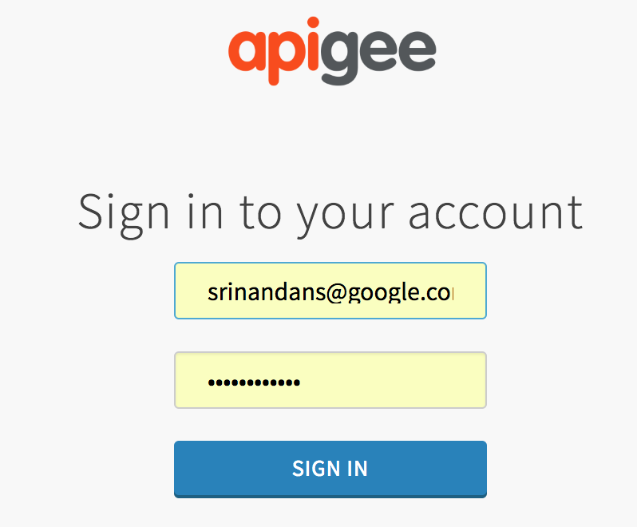
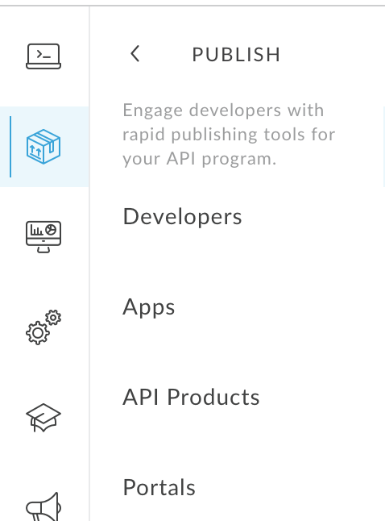
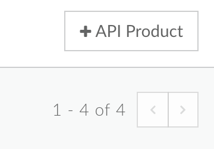
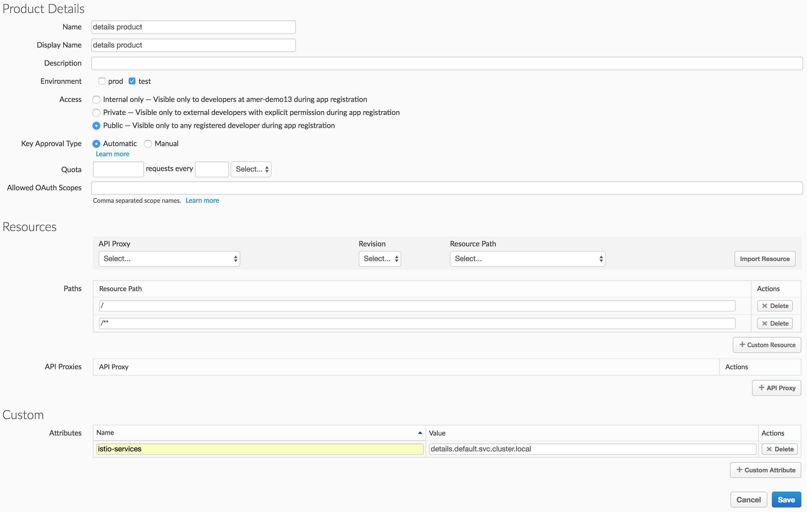
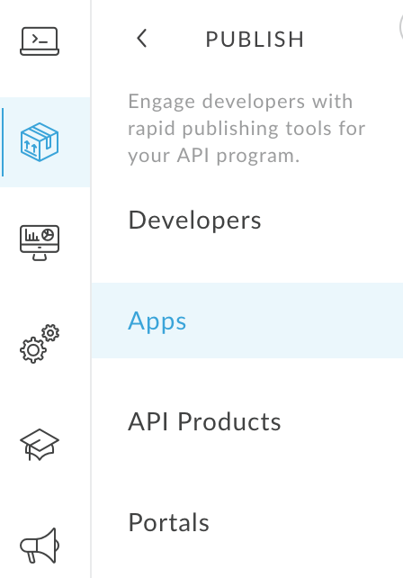
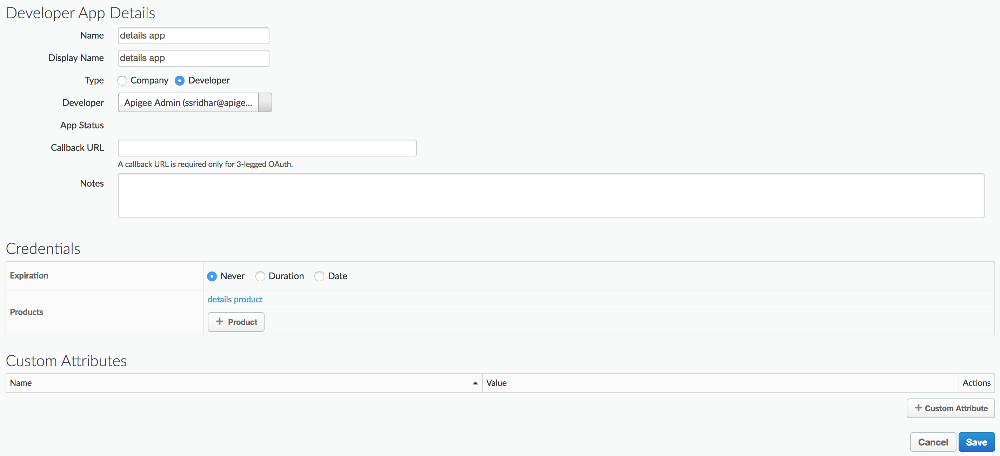
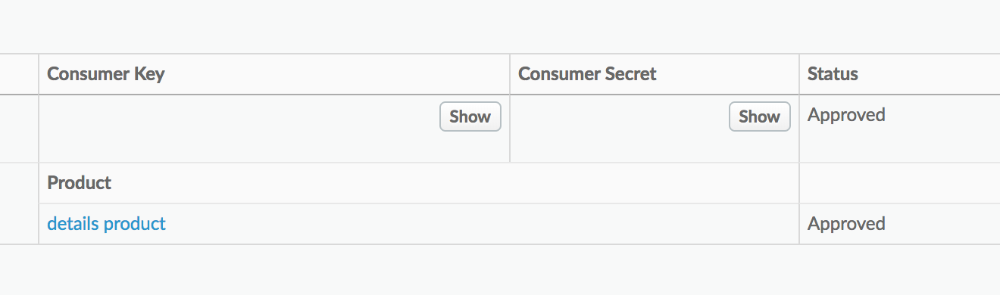
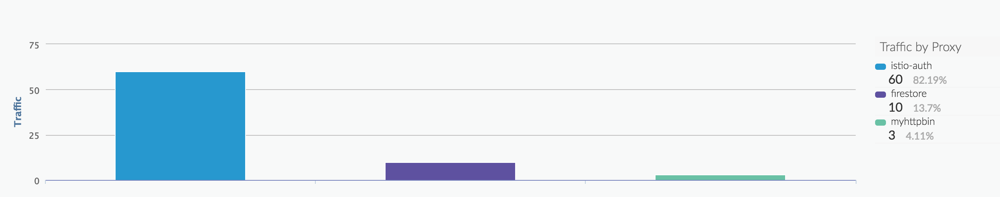

## Summary 
In this lab, you will learn how to configure and use Apigee API Management for Istio. Apigee API Management for Istio provides basic API gateway policies that can be applied to your microservices in a service mesh.

# Table of Contents
1. [Setup and Requirements](#setup-and-requirements)
2. [Installing Apigee API Management](#install)
3. [Recap](#recap)
4. [Publish the API as a Product](#publish)
5. [Consume an API Product](#consume)
6. [Obtain a JWT Token](#obtain)
7. [View API Analytics](#analytics)
8. [Full API Management](#fullapi)

## Setup and Requirements <a name="setup-and-requirements"/>
1. This lab assumes you have completed the last step of the previous lab (Enabling JWT in the security section).
2. You must have an [Apigee Edge](https://login.apigee.com) account. If you need one, you can create one [here](https://login.apigee.com/sign_up).

## Installing Apigee API Management for Istio <a name="install"/>
Apigee Istio Mixer Adapter releases can be found [here](https://github.com/apigee/istio-mixer-adapter/releases)

Download the appropriate release package for your operating system and extract it. You should a file list similar to:

    LICENSE
    README.md
    samples/apigee/authentication-policy.yaml
    samples/apigee/definitions.yaml
    samples/apigee/handler.yaml
    samples/apigee/httpapispec.yaml
    samples/apigee/rule.yaml
    samples/istio/helloworld.yaml
    samples/istio/istio-demo.yaml
    samples/istio/istio-demo-auth.yaml
    apigee-istio

`apigee-istio` (or apigee-istio.exe on Windows) is the Command Line Interface (CLI) for this project. 
You may add it to your PATH for quick access - or remember to specify the path for the commands below.

### Upgrade Istio
Apigee's Istio Mixer adapter only requires istio-policy and istio-telemetry to be updated. We could have a deployment that only updates those components. But in this case we're upgrading all the components (most of which should be unchanged anyway).

```
kubectl apply -f samples/istio/istio-demo-auth.yaml
```

You will see most of the messages as `component "component-name" unchanged`. This is expected. 

### Provision Apigee for Istio

Configuring Apigee for Istio is a four step process:
1. Configure your Apigee Edge instance to manage Istio (issue credentials, productize APIs in a service mesh, communicate securely to Apigee Edge etc.)
2. Configure Istio to create definitions for Apigee

The first thing you'll need to do is provision your Apigee environment to work with the Istio adapter. 
This will install a proxy, set up a certificate, and generate some credentials for you:  
```
    apigee-istio -u {your username} -p {your password} -o {your organization name} -e {your environment name} provision > samples/apigee/handler.yaml
```

Once it completes, check your `samples/apigee/handler.yaml` file. It should look like this (with different values):
```
    # istio handler configuration for apigee adapter
    # generated by apigee-istio provision on 2018-06-18 15:29:31
    apiVersion: config.istio.io/v1alpha2
    kind: apigee
    metadata:
      name: apigee-handler
      namespace: istio-system
    spec:
      apigee_base: https://istioservices.apigee.net/edgemicro
      customer_base: https://myorg-myenv.apigee.net/istio-auth
      org_name: myorg
      env_name: myenv
      key: 06a40b65005d03ea24c0d53de69ab795590b0c332526e97fed549471bdea00b9
      secret: 93550179f344150c6474956994e0943b3e93a3c90c64035f378dc05c98389633
```      

Apply the Apigee definitions for Istio. This defines the CRDs for Apigee.

```
kubectl apply -f samples/apigee/definitions.yaml
```
OUTPUT:
```
customresourcedefinition "apigees.config.istio.io" created
customresourcedefinition "analytics.config.istio.io" created
analytics "apigee" created
authorization "apigee" created
```

Apply the Apigee handler to Istio. The handler tells Mixer how to connect (securely) to Apigee.

```
kubectl apply -f samples/apigee/handler.yaml
```

OUTPUT:
```
apigee "apigee-handler" created
```

and finally, apply the rule. This tells Istio when to apply Apigee rules.

```
kubectl apply -f samples/apigee/rule.yaml
```
OUTPUT:
```
rule "apigee-rule" created
```
NOTE: in the sample rule, we apply Apigee rules to any service in the default namespace. This will prevent your UI from showing book details. But that is expected. We expect JWT tokens to access the `details` service and the `productspage` is not sending it.  

## Recap <a name="recap"/>
In the previous workshop we deploy the bookinfo application, exposed the details API and protected it via JWT. In this workshop, we're going to provide secure access to the API and generate usage/analytics metrics.

## Publish the API as a Product <a name="publish"/>
The first step will be to create an API Product in Apigee Edge.

1. Login to Apigee Edge
Use your Apigee credentials to login in.



2. Select Publish from the Edge UI


3. Select API Products under publish



4. Create a new product



5. Enter Product details

* Name: A Product Name
* Environment: which environment the API Product is available in
* Resouces: Which API Paths you want to expose
* Attributes: Add a custom attribute called `istio-services`. The values are a comma separated list of Istio services (FQDN).



## Consume an API Product <a name="consume"/>
Generally speaking, you would now go to the Apigee portal and request keys for the API Product we just created. To keep the lab simple, we will create those artifacts a portal would have through the Edge UI (Admin interface)

1. Select Developer App from the Edge UI



2. Create a new Developer App


3. Enter Developer App details
* Name: A new for the developer app
* Developer: The name of the developer who is authoring the app (client application)
* Product: A list of API Products



4. Make a note of the credentials



## Obtain a JWT Token <a name="obtain"/>
We will now use the `apigee-istio` CLI interface to obtain a new JWT token. The CLI interface is for convenience only. In production, client applications will use APIs to get an new JWT token.

```
export TOKEN=`apigee-istio token create -o amer-demo13 -e test -i xxx -s xxx`
```

The output is stored in an environment variable.

### Make an API Call
Now, we are ready to try the API again:

```
curl $GATEAWY_URL/details/0 -H "Authorization: Bearer $TOKEN"
```

OUTPUT:
```
{"id":0,"author":"William Shakespeare","year":1595,"type":"paperback","pages":200,"publisher":"PublisherA","language":"English","ISBN-10":"1234567890","ISBN-13":"123-1234567890"}
```
We have now successfully exposed an API to consumers outside the service mesh.

## View API Analytics <a name="analytics"/>
The Apigee adapter for Istio is able to send API usage/metrics asyncronously  to the Edge UI. In about 5-6 mins, you should be able to see usage metric for details showing up like this:



## Expose the API to third parties <a name="fullapi"/>
When exposing APIs externally, especially to third parties, the API Management policies you want enforced are typically different (more security focused) than when the API is used internally.

For APIs are exposed externally, you'd probably want:
* Some form of rate limiting
* JSON/XML threat protection (Minimizes the risk posed by content-level attacks by enabling you to specify limits on various XXML/SON structures, such as arrays and strings)
* Quotas (different from the ones you'd give internal users)

Apigee's API gateway provides with exactly such policies. In this part of the lab, you will create a proxy in Apigee Edge and have external users proxy requests through the Apigee Gateway.

```
./importproxy.sh {username} {password} {orgname} {envname}
```

This should deploy a proxy called `details` in your org and deploy it to the environment that was specified in the CLI.

### Access the API
Try accessing the API from the endpoint published in Apigee.

```
curl https://{org}-{env}.apigee.net/details/0 -H "Authorization: Bearer $TOKEN"
```

## Restrict Access to the internal API
The details API is available on a public IP `GATEWAY_URL`. Nothing prevents an external user to bypass Apigee and access the endpoint directly. It is a good thing we still require OAuth tokens to access the endpoint, but we still want only Apigee's proxy to access the endpoint.


Istio provides a native adapter (listchecker) to whitelist or blacklist IPs. The following steps will show you how to use it.

1. Obtain the IP address of Apigee Edge
```
curl -X GET https://api.enterprise.apigee.com/v1/o/{org}/eips -u {user}:{pass}
```
OUTPUT:
```
{
  "podEips" : [ {
    "eips" : [ ],
    "pod" : {
      "name" : "pxx0rt000-0",
      "region" : "us-east-1"
    }
  }, {
    "eips" : [ "xxx.xx.xxx.xx", "xx.xxx.xxx.xx" ],
    "pod" : {
      "name" : "pxx0mp000-0",
      "region" : "us-east-1"
    }
  } ]
}
```
The `eips` field contains the IP addresses assigned to the Apigee gateways.

2. Configure Mixer to allow only those IPs
This section contains three parts:
  a. listchecker: provide a list of ips to whitelist
  b. listentry: provide the location of the ip
  c. rule: when do i apply this adapter, in this case, when the call comes to the ingress

```
apiVersion: "config.istio.io/v1alpha2"
kind: listchecker
metadata:
  name: ip-listchecker
  namespace: istio-system
spec:
  entryType: IP_ADDRESSES
  overrides: [ "107.23.127.92", "54.210.253.51" ]
  blacklist: false
---
apiVersion: config.istio.io/v1alpha2
kind: listentry
metadata:
  name: ip-value
  namespace: istio-system
spec:
  value: source.ip
---
apiVersion: "config.istio.io/v1alpha2"
kind: rule
metadata:
  name: ip-rule
  namespace: istio-system
spec:
  match: destination.labels["istio"] == "ingressgateway"
  actions:
  - handler: ip-listchecker.listchecker
    instances:
    - ip-value.listentry
```

[WIP: this step is not complete yet]