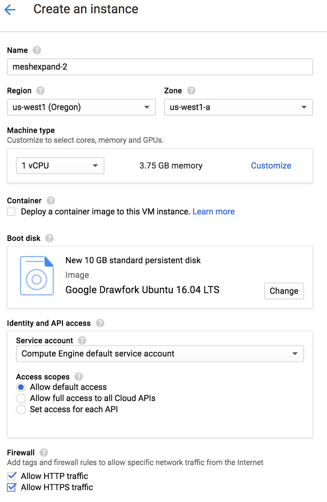

## Summary 
In this lab, you will learn how to expand the service mesh to include VM. Mesh expansion refers to a pattern where the Istio control plane (Pilot, Mixer & Citadel) are on Kubernetes and the sidecar envoy is on VMs. With this pattern you can bring workloads running on VMs into the Istio Service Mesh. 

# Table of Contents
1. [Pre-requisites](#prereq)
2. [Setup a GCE Instance](#gce) 
3. [Testing the mesh expansion setup](#meshtest)
4. [Access services in the mesh](#access)
5. [Expose a service to the mesh](#expose)

## Pre-requisites <a name="prereq"/>
In order to complete this lab, you should have completed the instructions in the Istio Workshop.

## Setup a GCE Instance <a name="gce"/>
Create a new GCE instance. Let's call it `meshexpand` (this name will be used later).

1. Create a new Instance
* Zone: us-west1-a (this will be needed later)
* Name: meshexpand
* Boot Disk: Google Drawfork Ubuntu 16.04
* Allow HTTP and HTTPS traffic



2. In the Google Cloud Shell, run the following commands
   - Generate ssh keys
     ```
     ssh-keygen -t rsa -b 4096 -C "youremail"
     ```
   - Add ssh key
     ```
     ssh-add ~/.ssh/id_rsa
     ```
     NOTE: if you get the error "Could not open a connection to your authentication agent.", then run 
     ```
     eval `ssh-agent -s`
     ```
   - Test ssh connection
     ```
     ssh vmUser@vmIP
     ```
     NOTE: If your ssh times out, ssh port (22) is probably blocked. Then run the following commands
     ```
     gcloud compute firewall-rules create open-22 --allow tcp:22 --source-ranges 0.0.0.0/0 --target-tags open-22
     ```
     ```
     gcloud compute instances add-tags meshexpand --tags open-22
     ```
3. Enable the Kuernetes cluster for mesh expansion

```
kubectl apply -f install/kubernetes/mesh-expansion.yaml
```
OUTPUT:
```
service "istio-pilot-ilb" created
service "dns-ilb" created
service "mixer-ilb" created
service "citadel-ilb" created
```

Confirm that the load balancers are running and that they have EXTERNAL-IP values:

```
kubectl get services -n istio-system
```

Caution: The EXTERNAL-IP column might show `<pending>` until the services are fully up and running. Do not proceed with the installation until they have EXTERNAL-IP values.

4. Export environment variables
```
export GCP_OPTS="--zone {zone} --project {project}"
export SERVICE_NAMESPACE=default
```
5. Generate the cluster configuration file
```
install/tools/setupMeshEx.sh generateClusterEnv {clustername}
```
This command creates a file named cluster.env in the current directory that contains a single line in the form:
```
ISTIO_SERVICE_CIDR=10.35.240.0/20
ISTIO_SYSTEM_NAMESPACE=istio-system
CONTROL_PLANE_AUTH_POLICY=MUTUAL_TLS
```

6. Generate the DNS configuration file
```
install/tools/setupMeshEx.sh generateDnsmasq
```
OUTPUT:
```
Generated Dnsmaq config file 'kubedns'. Install it in /etc/dnsmasq.d and restart dnsmasq.
install/tools/setupMeshEx.sh machineSetup does this for you.
```
7. Setup the GCE instance (note this only works for GCE)
```
install/tools/setupMeshEx.sh gceMachineSetup meshexpand
```
Here, `meshexpand` is the VM name.

OUTPUT:
```
......lot of lines
Selecting previously unselected package host.
(Reading database ... 98786 files and directories currently installed.)
Preparing to unpack .../host_1%3a9.10.3.dfsg.P4-8ubuntu1.10_all.deb ...
Unpacking host (1:9.10.3.dfsg.P4-8ubuntu1.10) ...
Setting up host (1:9.10.3.dfsg.P4-8ubuntu1.10) ...
*** Restarting istio proxy...
```
8. Complete the setup
Login to the VM and enable the certs to be read by users

```
chmod +r /etc/certs/*.pem
```

Restart istio-proxy and the node-agent
```
systemctl restart istio
systemctl restart istio-auth-node-agent
```

Create a user. The sidecar does not intercept traffic from root. To test our setup, we will create a new user

```
groupadd meshexpand
useradd meshexpand -g meshexpand -m -d /opt/meshexpand
```

## Testing the mesh expansion setup <a name="meshtest"/>

Run the command
```
host istio-pilot.istio-system
```
OUTPUT:
```
istio-pilot.istio-system has address 10.138.0.18
```

Run the command
```
host istio-pilot.istio-system.svc.cluster.local.
```
OUTPUT:
```
istio-pilot.istio-system.svc.cluster.local has address 10.35.244.91
```

Run the command
```
curl 'http://istio-pilot.istio-system:8080/v1/registration/istio-pilot.istio-system.svc.cluster.local|http-discovery'
```
OUTPUT:
```
{
  "hosts": [
   {
    "ip_address": "10.32.0.7",
    "port": 15007,
    "tags": {
     "az": "us-west1/us-west1-a"
    }
   }
  ]
 }
```
## Access services in the mesh <a name="access"/>
Access the details service from the VM.
```
curl details.default.svc.cluster.local:9080/details/0 -v
```
OUTPUT:
```
*   Trying 10.35.255.72...
* Connected to details.default.svc.cluster.local (10.35.255.72) port 9080 (#0)
> GET /details/0 HTTP/1.1
> Host: details.default.svc.cluster.local:9080
> User-Agent: curl/7.47.0
> Accept: */*
> 
< HTTP/1.1 200 OK
< content-type: application/json
< server: envoy
< date: Sat, 30 Jun 2018 17:45:27 GMT
< content-length: 178
< x-envoy-upstream-service-time: 15
< 
* Connection #0 to host details.default.svc.cluster.local left intact
{"id":0,"author":"William Shakespeare","year":1595,"type":"paperback","pages":200,"publisher":"PublisherA","language":"English","ISBN-10":"1234567890","ISBN-13":"123-1234567890"}
```

At this point, you have added this VM into the mesh. This VM can access services in the mesh as if that VM were in Kubernetes.

## Expose a service to the mesh <a name="expose"/>
1. We will install a basic node.js application. Run the following commands:
```
apt-get update && apt-get install -y gnupg curl
curl -sL https://deb.nodesource.com/setup_8.x | bash -
apt-get install -y nodejs 
```
2. Switch to the `meshexpand` user

3. Create a package.json
```
echo "{\"name\": \"mtlstest\",\"version\": \"1.0.0\",\"main\": \"index.js\",\"scripts\": {\"start\": \"node index.js\"},\"dependencies\": {\"express\": \"^4.16.1\"}}" >> package.json
```

4. Create index.js
Paste the contents into index..js
```
var express = require('express');var app = express();app.get('/*', function (req, res) {res.send('Hello World!');});app.listen(8080, function () {});
```

5. Install npm packages and start
```
npm install --save express
```
```
nohup node index.js &
```
6. Switch back to root user and get cluster credentials
```
gcloud container clusters get-credentials istio --zone us-west1-a --project nandanks-151422
```
7. Get the service account
```
gcloud compute instances describe meshexpand
```
The output of this command includes the email address of the service account, in the from:
```
serviceAccounts:
- email: 10570444441-compute@developer.gserviceaccount.com
```
8. Register the service on the VM into the mesh
```
./bin/istioctl -n default register --serviceaccount 10570444441-compute@developer.gserviceaccount.com meshexpand 10.138.0.17 8080 -l version=v1
```
OUTPUT:
```
2018-06-30T22:33:16.302271Z     info    Registering for service 'meshexpand' ip '10.138.0.17', ports list [{8080 http}]
2018-06-30T22:33:16.302562Z     info    1 labels ([version=v1]) and 1 annotations ([alpha.istio.io/kubernetes-serviceaccounts=102128743119-compute@developer.gserviceaccount.com])
....
2018-06-30T22:33:16.343740Z     info    On ports [{Name:http Port:8080 Protocol:TCP}]
2018-06-30T22:33:16.343961Z     info    Found {IP:10.138.0.17 Hostname: NodeName:<nil> TargetRef:nil}
2018-06-30T22:33:16.344135Z     info    Found matching ports list in existing subset [{http 8080 TCP}]
2018-06-30T22:33:16.347498Z     info    Successfully updated meshexpand, now with 1 endpoints
2018-06-30T22:33:16.347889Z     info    Details: &Endpoints{ObjectMeta:k8s_io_apimachinery_pkg_apis_meta_v1.ObjectMeta{Name:meshexpand,GenerateName:,
....
```
Confirm the changes.
```
kubectl describe svc meshexpand
```
Expected output:
```
Name:              meshexpand
Namespace:         default
Labels:            <none>
Annotations:       alpha.istio.io/kubernetes-serviceaccounts=10570444441-compute@developer.gserviceaccount.com
Selector:          <none>
Type:              ClusterIP
IP:                10.35.254.116
Port:              http  8080/TCP
TargetPort:        8080/TCP
Endpoints:         10.138.0.17:8080
Session Affinity:  None
Events:            <none>
```
if your `Annotations` look like `alpha.istio.io/kubernetes-serviceaccounts=default` then,

```
kubectl edit svc meshexpand
```
replace `default` with the service account and save the file.


9. Configure the sidecar
Edit the file `/var/lib/istio/envoy/sidecar.env`
Add the followling lines
```
ISTIO_INBOUND_PORTS=8080
ISTIO_SERVICE=meshexpand
ISTIO_NAMESPACE=default
```

10. Restart istio-proxy and the node-agent
```
systemctl restart istio
systemctl restart istio-auth-node-agent
```
11. Check IP Table rules
```
iptables-save | grep -i istio
```
OUTPUT:
```
# Generated by iptables-save v1.6.0 on Sat Jun 30 22:38:45 2018
....
-A PREROUTING -p tcp -j ISTIO_INBOUND
-A OUTPUT -p tcp -j ISTIO_OUTPUT
-A ISTIO_INBOUND -p tcp -m tcp --dport 8080 -j ISTIO_REDIRECT
-A ISTIO_OUTPUT ! -d 127.0.0.1/32 -o lo -j ISTIO_REDIRECT
```

12. Expose the service on the virtual host
This step  will expose the service outside the mesh by making it available in the ingress

Obtain the original virtualservice

```
istioctl get virtualservices bookinfo -o yaml >> bookinfo.yaml
```
In the VirtualService, add the following lines:
```
spec:
  gateways:
  - bookinfo-gateway
  hosts:
  - '*'
  http:
  ....
  - match:
    - uri:
       prefix: /mesh
    route:
    - destination:
        host: meshexpand
        subset: v1
        port:
          number: 8080
```
Add a new DestinationRule
```
cat <<EOF | istioctl create -f -
apiVersion: networking.istio.io/v1alpha3
kind: DestinationRule
metadata:
  name: mesh-dest-rule
  namespace: default
spec:
  host: meshexpand.default.svc.cluster.local
  subsets:
  - name: v1
    labels:
      version: v1
  trafficPolicy:
    tls:
      mode: ISTIO_MUTUAL
```
13. Access the service from inside the mesh
Access the mtlstest pod
```
kubectl exec -it {podname} /bin/bash
```
Access the service
```
curl meshexpand.default.svc.cluster.local:8080 -v
```

OUTPUT:
```
* Rebuilt URL to: meshexpand.default.svc.cluster.local:8080/
*   Trying 10.35.254.116...
* TCP_NODELAY set
* Connected to meshexpand.default.svc.cluster.local (10.35.254.116) port 8080 (#0)
> GET / HTTP/1.1
> Host: meshexpand.default.svc.cluster.local:8080
> User-Agent: curl/7.58.0
> Accept: */*
>
< HTTP/1.1 200 OK
< x-powered-by: Express
< content-type: text/html; charset=utf-8
< content-length: 12
< etag: W/"c-Lve95gjOVATpfV8EL5X4nxwjKHE"
< date: Sat, 07 Jul 2018 01:49:52 GMT
< x-envoy-upstream-service-time: 7
< server: envoy
<
* Connection #0 to host meshexpand.default.svc.cluster.local left intact
Hello World!
```

14. Access the service from outside the mesh

```
curl $GATEWAY/mesh -v
```
NOTE: this is a WIP. I'm missing a step. The service is not accessible. 