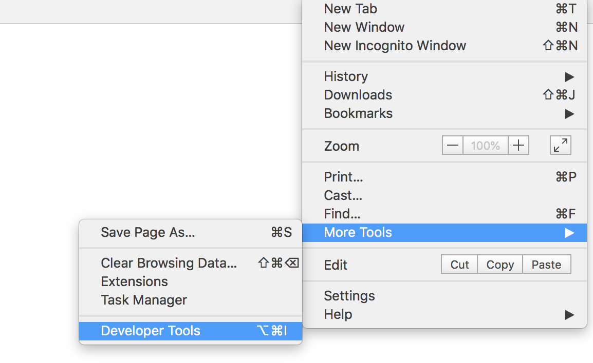
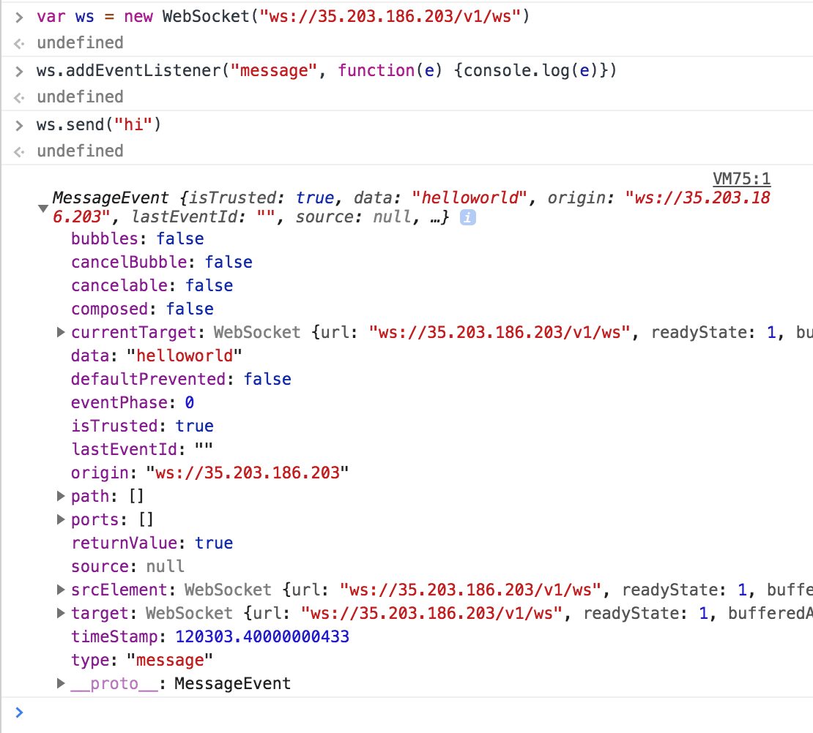

## Summary 
In this lab, you will learn a few additional capabilities of Istio.

# Table of Contents
1. [Setup and Requirements](#setup-and-requirements)
2. Web Sockets
   - [Install sample websocket app](#install)
   - [Test websocket application](#test)
3. [Rate Limiting](#quota)
4. [Expose external services](#expose)
   - [Within the service mesh](#within)
   - [Outside the mesh](#outside)

## Setup and Requirements <a name="setup-and-requirements"/>
This lab assumes you have bookinfo application from the main lab.

## Install sample websocket app <a name="install"/>
In this part of the lab, you will install and configure a sample websocket application

1. Build a sample application
```
./websocket/dockerbuild.sh
```

2. Push the application to GCP
```
./websocket/dockerpush.sh
```

3. Deploy the application to Kubernetes
```
kubectl apply -f <(istioctl kube-inject -f ./websocket/websockets.yaml)
```

4. Edit bookinfo virtual services to add new routes
```
kubectl edit virtualservice bookinfo
```
Add the following lines to the bookinfo virtual service
```
  - match:
    - uri:
        exact: /v1/ws
    route:
    - destination:
        host: websockets
        port:
          number: 3000
    websocketUpgrade: true
  - match:
    - uri:
        exact: /
    route:
    - destination:
        host: websockets
        port:
          number: 3000
```

## Test websocket application <a name="test"/>
1. Open a Chrome tab and go to the $GATEWAY endpoint. You should see this message


2. Open developer tools in Chrome


3. Open a websocket connection and test


The first step opens a websocket connection to the server. The second step registers a listener for incoming messages and prints the message from the server. The last step send a message to the server.

In this example, I'm sending `hi` to the server and the server responds with `helloworld`.

## Rate Limiting <a name="quota"/>
In this part of the lab, we will enable rate limiting on a service. 

### Understanding Quota
There are four parts to quota. 
* The `memquota` adapter uses a sliding window of sub second resolution to enforce rate limits. The `maxAmount` in the adapter configuration sets the default limit for all counters associated with a quota instance. This default limit applies if a quota override does not match the request. In the example, we will set a quota on the `details` service for 3 per minute. 
* The kind `quota` specifies the quota identifier. In this case it is the `destination.service`. 
* The `QuotaSpec` determines the message weight. In this case, we will increase the counter by 1.
* The `QuotaSpecBinding` determines to which services the `QuotaSpec` must be applied to. In this case, the `details` service.
* The `rule` which specifies when the quota adapter should be active. In this case, there is no match condition, because we are using `QuotaSpecBinding` to   control which servies the quota applies to. 

If the number of requests exceeds the quota, Mixer returns a RESOURCE_EXHAUSTED message to the proxy. The proxy in turn returns status HTTP 429 to the caller.

1. Apply Quota Policy
```
cat <<EOF | kubectl apply -f -
apiVersion: config.istio.io/v1alpha2
kind: memquota
metadata:
  name: details-handler
  namespace: istio-system
spec:
  quotas:
  - name: requestcount.quota.istio-system
    maxAmount: 5000
    validDuration: 1s
    overrides:
    - dimensions:
        destination: details
      maxAmount: 3
      validDuration: 1m
---
apiVersion: config.istio.io/v1alpha2
kind: quota
metadata:
  name: requestcount
  namespace: istio-system
spec:
  dimensions:
    destination: destination.labels["app"] | destination.service | "unknown"
---
apiVersion: config.istio.io/v1alpha2
kind: QuotaSpec
metadata:
  name: request-count-quotaspec
  namespace: istio-system
spec:
  rules:
  - quotas:
    - charge: "1"
      quota: requestcount
---
apiVersion: config.istio.io/v1alpha2
kind: QuotaSpecBinding
metadata:
  name: request-count-quotaspecbinding
  namespace: istio-system
spec:
  quotaSpecs:
  - name: request-count-quotaspec
    namespace: istio-system
  services:
  - name: details
    namespace: default
---
apiVersion: config.istio.io/v1alpha2
kind: rule
metadata:
  name: quota
  namespace: istio-system
spec:
  actions:
  - handler: details-handler.memquota
    instances:
    - requestcount.quota
EOF
```

2. Test the quota policy
Run a set of curl commands to test the quota

```
while true; do curl $GATEWAY/details/0; done
```

OUTPUT:
```
{"id":0,"author":"William Shakespeare","year":1595,"type":"paperback","pages":200,"publisher":"PublisherA","language":"English","ISBN-10":"1234567890","ISBN-13":"123-1234567890"}{"id":0,"author":"William Shakespeare","year":1595,"type":"paperback","pages":200,"publisher":"PublisherA","language":"English","ISBN-10":"1234567890","ISBN-13":"123-1234567890"}{"id":0,"author":"William Shakespeare","year":1595,"type":"paperback","pages":200,"publisher":"PublisherA","language":"English","ISBN-10":"1234567890","ISBN-13":"123-1234567890"}RESOURCE_EXHAUSTED:Quota is exhausted for: requestcountRESOURCE_EXHAUSTED:Quota is exhausted for: requestcountRESOURCE_EXHAUSTED:Quota is exhausted for: requestcountRESOURCE_EXHAUSTED:Quota is exhausted for: requestcountRESOURCE_EXHAUSTED:Quota is exhausted for: requestcount
```

You'll notice that after three calls, the quota is exhausted.

## Expose external services <a name="expose"/>
In this part of the lab, you'll see how to expose external services (services not managed by Istio) to consumers within and outside the service mesh.

### Within the service mesh <a name="within"/>
In this section, we will expose a service outside the mesh for consumption within the mesh. For this example, we will expose the service `httpbin.org` to consumers within the mesh.

#### Purpose
* Allows the mesh operator to control which services/endpoints are exposed inside the mesh
* Even if the endpoint changes the consumer is protected by these changes. Consumers access the external service using an internal name.
* Allows the mesh operator to apply security (TLS) before the call is made externally in one centralized location. 

1. Create a `ServiceEntry`
A service entry describes the properties of a service (DNS name, VIPs ,ports, protocols, endpoints). 

```
cat EOF << | kubectl apply -f -
apiVersion: networking.istio.io/v1alpha3
kind: ServiceEntry
metadata:
  name: httpbin-ext
  namespace: default
spec:
  hosts:
  - httpbin.org
  location: MESH_EXTERNAL
  ports:
  - name: http
    number: 80
    protocol: HTTP
  resolution: DNS
EOF
```
2. Create a `Service`

```
apiVersion: v1
kind: Service
metadata:
  labels:
    app: httpbinapi
    version: v1
  name: httpbinapi
  namespace: default
spec:
  externalName: httpbin.org
  selector:
    app: httpbinapi
  sessionAffinity: None
  type: ExternalName
```
3. Create a `VirtualService`

```
apiVersion: networking.istio.io/v1alpha3
kind: VirtualService
metadata:
  name: httpbin-internal
  namespace: default
spec:
  gateways:
  - mesh
  hosts:
  - httpbinapi.default.svc.cluster.local
  http:
    match:
    - uri:
        exact: /ip
    rewrite:
      authority: httpbin.org
      uri: /ip
    route:
    - destination:
        host: httpbin.org
```
Note the gateway uses the name `mesh`. The reserved word mesh is used to imply all the sidecars in the mesh.

4. Access the service from inside the mesh

```
kubectl exec -it mtlstest-5f4d7d858-zhcnc /bin/bash
```

```
curl httpbinapi.default.svc.cluster.local/ip -v
```

OUTPUT:
```
*   Trying 34.238.48.57...
* TCP_NODELAY set
* Connected to httpbinapi.default.svc.cluster.local (34.238.48.57) port 80 (#0)
> GET /ip HTTP/1.1
> Host: httpbinapi.default.svc.cluster.local
> User-Agent: curl/7.58.0
> Accept: */*
>
< HTTP/1.1 200 OK
< server: envoy
< date: Mon, 23 Jul 2018 04:54:48 GMT
< content-type: application/json
< content-length: 28
< access-control-allow-origin: *
< access-control-allow-credentials: true
< via: 1.1 vegur
< x-envoy-upstream-service-time: 133
<
{"origin":"35.xxx.xxx.xxx"}
* Connection #0 to host httpbinapi.default.svc.cluster.local left intact
```

### Outside the service mesh <a name="outside"/>
In this section, we will expose a service outside the mesh for consumption at the ingress. For this example, we will expose the service `httpbin.org` at the ingress.

1. Edit the `VirtualService`

Add the following lines
```
  - match:
    - uri:
        exact: /ip
    rewrite:
      authority: httpbin.org
      uri: /ip
    route:
    - destination:
        host: httpbin.org
```

2. Access the service

```
curl $GATEWAY/ip -v
```

OUTPUT:
```
*   Trying xx.xxx.xxx.203...
* TCP_NODELAY set
* Connected to xx.xxx.xxx.203 (35.203.186.203) port 80 (#0)
> GET /ip HTTP/1.1
> Host: xx.xxx.xxx.203
> User-Agent: curl/7.52.1
> Accept: */*
>
< HTTP/1.1 200 OK
< server: envoy
< date: Mon, 23 Jul 2018 04:57:57 GMT
< content-type: application/json
< content-length: 40
< access-control-allow-origin: *
< access-control-allow-credentials: true
< via: 1.1 vegur
< x-envoy-upstream-service-time: 135
<
{"origin":"10.138.0.7, xx.xxx.xxx.181"}
* Curl_http_done: called premature == 0
* Connection #0 to host xx.xxx.xxx.203 left intact
```
#### Purpose
* Even if the endpoint changes the consumer is protected by these changes. Consumers access the external service using the ingress name.
* Allows the mesh operator to apply security (TLS) before the call is made externally in one centralized location.